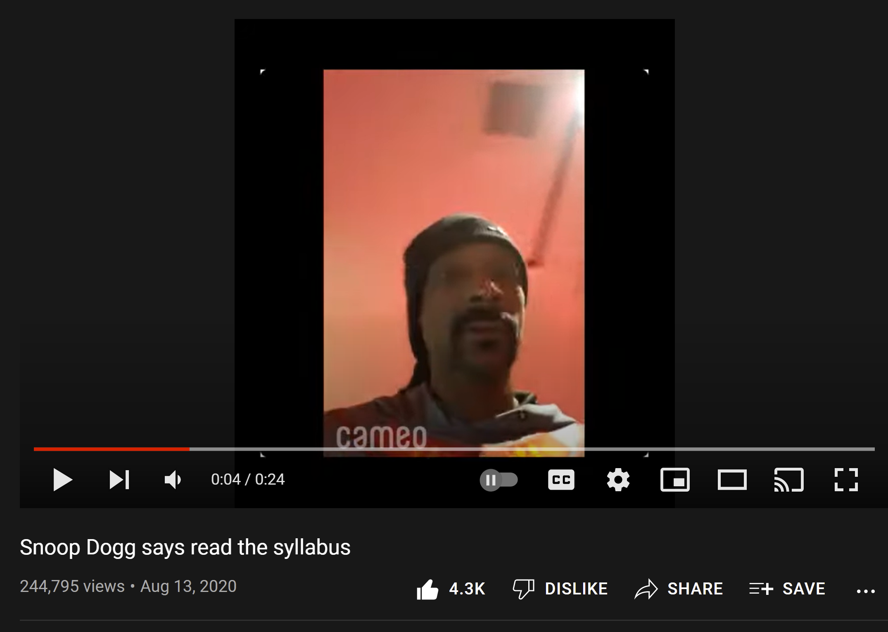
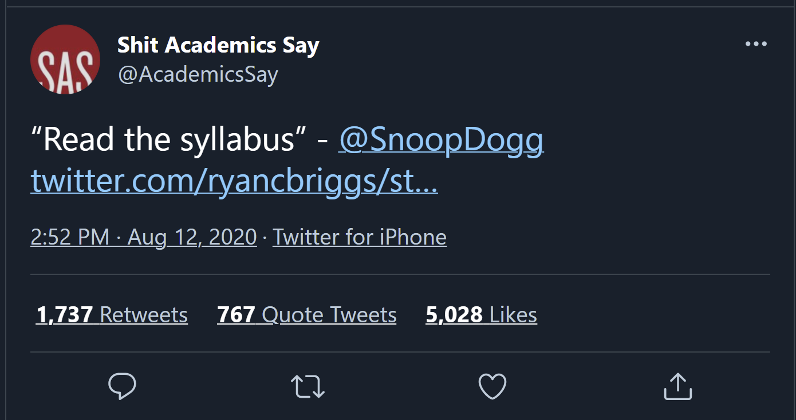

# (PART\*) Syllabi {-}

# General information {-}


```{r include = FALSE}
source("common.R")
library(webshot)

```

```{r links, child="links.md"}
```

Welcome! This section includes general syllabus information. The next sections include information specific to your class. (Now, before I forget, any matter not explicitly covered by the syllabus or institution-wide policy is left to my sole discretion as the instructor.)

Remember: This course is for you, not for me. 


```{r, echo=FALSE, cache = TRUE}
if (knitr::is_latex_output()) {

}else{
"https://www.youtube.com/watch?v=aL_fP5axQV4"%>%
embed_url() %>%
  use_align("center")
}
```

Credit: 

```{r, echo=FALSE, cache = TRUE}
if (knitr::is_latex_output()) {

}else{
include_tweet("https://twitter.com/AcademicsSay/status/1293621452684644355")
}
```


## Materials

If you chose to use alternative materials, such as an older edition of the book, it is your responsibility to ensure that those materials are equivalent.


### Required Texts

For all my classes, the textbook is intended to supplement the course. 
The lectures don't follow the order of chapters in the text and the text covers some material that won't be covered in the lectures, i.e., not all the information in each chapter is perfectly pertinent to the course requirements. 

It is one of many resources you'll consume. 
You probably need to consume all of the resources I provide in order to be successful in this class. 
If you'd like to make the most of your tuition, I strongly encourage you to consume them all. 
The course-specific resources can be found on the specific course page.

### Hardware

Most of my classes require that you have a computer that can run R and stream videos from youtube.

### Software

#### R and RStudio

```{r, echo=FALSE}

if (knitr::is_latex_output()) {
}else{
"https://www.youtube.com/watch?v=kVIZGCT5p9U" %>%
 embed_url() %>%
 use_align("center")
}


```

R is a free software environment for statistical computing and graphics. It compiles and runs on a wide variety of UNIX platforms, Windows, and MacOS.

RStudio is a free _integrated development environment_ (IDE), a powerful user interface for R.

#### Git and Github

Git is a version control system. Its original purpose was to help groups of developers work collaboratively on big software projects. Git manages the evolution of a set of files – called a repository – in a structured way. Think of it like the "Track Changes" features from Microsoft Word.

Github is a free IDE and hosting service for Git. As a Wake Forest student, you should be able to access the [GitHub Student Developer Pack for free](https://education.github.com/benefits?type=student). It includes a free PRO upgrade for your github account.


