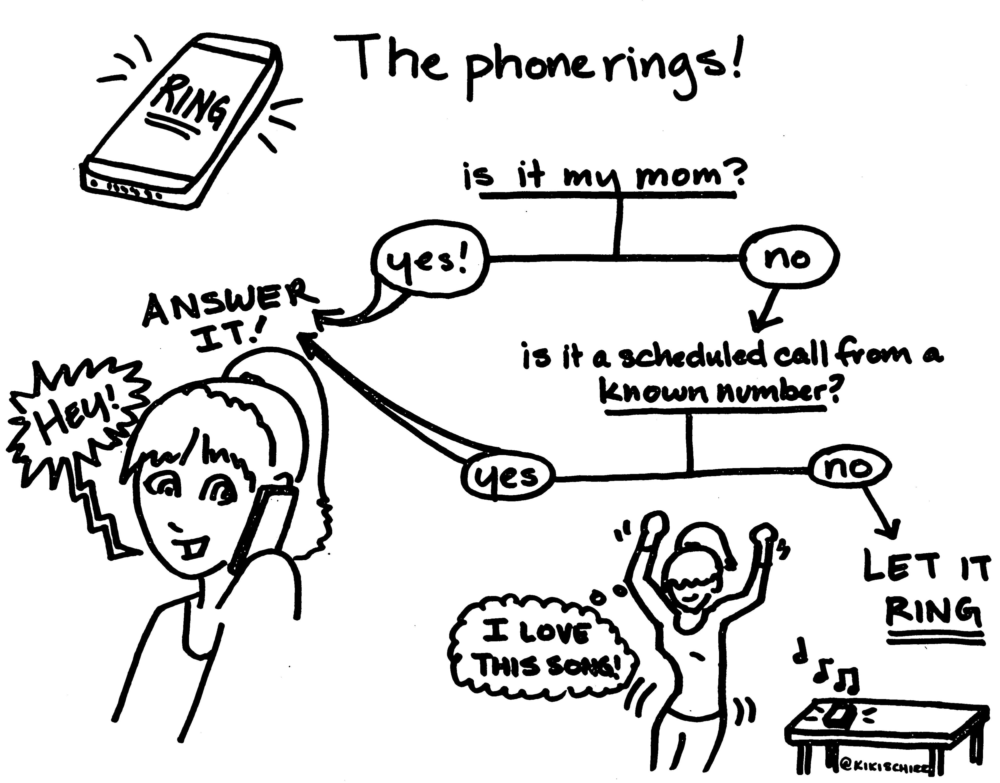
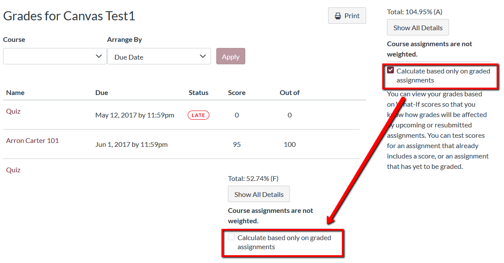
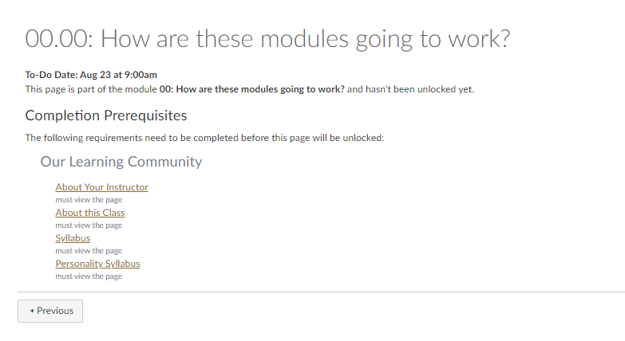

```{r include = FALSE}
source("common.R")
```

# Frequently Asked Questions

Below you'll find answers to the questions that I get asked the most by students in my classes. I have been asked every single one of these questions.

I don't want to discourage you from asking questions. However, asking me is not an efficient method for finding facts and searchable information...

```{r, echo=FALSE}
try(include_tweet("https://twitter.com/AlisonLedg/status/1441181845706579969"))
```

## How can I get ahold of you?

* Face2Face: Green 438

* Calendly Appointments: https://calendly.com/smasongarrison

* Email: garrissm@wfu.edu

* Text: 267.357.4392

* Github: https://github.com/smasongarrison

* Twitter: https://twitter.com/SMasonGarrison

* Phone Call: ...

```{r echo = FALSE,out.width='50%', fig.align='center'}


```

Credit: [Kiki Schirr](https://kikischirr.medium.com/) at [Tech Doodles](https://medium.com/tech-doodles) on ["Why this millennial didn't answer your call"](https://medium.com/tech-doodles/why-this-millennial-didnt-answer-your-call-d5abccf06cfc)


## General Course Questions

If you have a question about the course AND can't find your answer elsewhere (or you find conflicting answers), please post them on the class discussion board. (Depending on the class, this board will either be on canvas or github)

### Does it hurt to ask...

Yes, it actually DOES hurt to ask. If you know your Prof or the syllabus has a specific policy on something, but you ask for a special exception to be made for you anyway under the idea, “it doesn’t hurt to ask,” let me just tell you, yes—it really does. It can make you look bad, it can burn bridges, my goodwill & grace, and connections you may need later. Please don't ask your profs for special treatment or to disregard syllabus policies they are required to adhere to.


### Where...

#### Where can I find the reading list for the entire semester?
You can find the suggested readings for each module either on canvas or the GitHub course notes.

#### Where can I find when assignments are due?
You can find due dates in the syllabus and on canvas.

#### Where can I check the closing time of assessments?

You can check the due time and closing time of assessments by clicking the corresponding page in "Modules".

#### Where are my grades?

You can find it on canvas, under grades. I will not look up this grade for you. You are all hard working and problem-solving students. I believe in you!

#### Where can I find more information about...

- [WFU technology services or computer resources](https://is.wfu.edu/student/)
- [WFU student resources](https://college.wfu.edu/student-resources/)
- [Center for Learning, Access, and Student Success](https://class.wfu.edu/)
- [Office of Academic Advising](https://advising.wfu.edu/)
- [Office of Wellbeing](https://thrive.wfu.edu/)
- [WFU's Service Status Dashboard](https://status.is.wfu.edu/)
- [WFU Campus Map](https://map.wfu.edu/)
- [WFU Library](https://zsr.wfu.edu/)


#### Where can I find help for canvas?

If you're having trouble with Canvas, you should first search the [Canvas Guides](https://community.canvaslms.com/t5/Canvas-Basics-Guide/tkb-p/basics) and then reach out to canvas support. Although I am not Canvas tech support, I have provided some answers and resources to commonly asked questions in a later [section][canvas]. 

### Where can I find textbooks and course materials?

- If you'd like to purchase materials, you can do so from any bookstore, including Wake Forest's.
- If you'd like to rent materials, you can do so from anywhere you'd like, including Wake Forest's Bookstore or the publisher.
- If you'd like to get materials for free, you can borrow the materials from the library course reserve. 
- If you'd like to get materials for free, you can borrow the materials from someone who'se already taken the course.
- **Obviously**, I can't recommend finding the materials online... 

```{r, echo=FALSE}
"https://twitter.com/GaloAndStuff/status/1424818560417902604" %>%
include_tweet()
```

### Can...

#### Can you bump up my grade?

No. Please don't [grade grub](https://undergraduateswrite.com/2019/05/10/i-say-grade-grubbing-you-say-it-doesnt-hurt-to-ask-on-asking-teachers-to-bump-your-final-grade/). [Seriously, don't do it at the end of the semester.](https://undergraduateswrite.com/2019/05/10/i-say-grade-grubbing-you-say-it-doesnt-hurt-to-ask-on-asking-teachers-to-bump-your-final-grade/) Don't ask me for extra credit or special opportunities to boost your grade. Please don't pull on my heart strings about how you need a certain grade or there will be consequences for you. I know that many students think that it doesn't hurt to ask. It does. It hurts me. Although I care deeply about my students, I have to say no because it isn't equitable. So please don't ask for the grade boost. Seriously, I get enough emotional manipulation from my cats for leaving them at home all day. 

* https://undergraduateswrite.com/2019/05/10/i-say-grade-grubbing-you-say-it-doesnt-hurt-to-ask-on-asking-teachers-to-bump-your-final-grade


#### Can I rent the textbook for this course from somewhere (Amazon, bookstores, etc.)?
Of course. You can rent the book from Amazon or anywhere else you'd like.

#### Can you calculate my grade for me?
No. I believe in you!

You are capable of calculating a weighted average. 
You have 100% of the information you need to do so as outlined in the syllabus. 
You can calculate your grade using a weighted average and the weightings in the syllabus.
If you really really need help with this, try [this website](https://thegradecalculator.com/).

#### Can my parents email you about my class performance?
Unless you are legally a minor, I cannot answer your parents questions about this class.


##### Should my parents email you about my class performance?
No.


#### Can't you just tell me my letter grade? Your curve is confusing. 
I agree that my curve is a little confusing at first glance.
But, this curve can only help you. It means I can lower the thresholds for letter grades, but not raise them.
Your best approach is to pretend that there is no curve.

### What...

#### What can I do to get a better grade?

The work...

```{r,echo = FALSE}
if (knitr::is_latex_output()) {
include_graphics("img/worriedgrade.png")
}else{
"https://www.youtube.com/watch?v=WVvKnq5XT-g" %>%
embed_url() %>%
  use_align("center")
}
```


### Why...

#### Why is the <assignment/activity/quiz> locked?
Because you didn't complete all the requirements to unlock it... To unlock the activity/module, you need to do whatever is listed.

#### Why do I have to meet with you if I want to see my test again? Why can't you just release them?

Unfortunately, my tests/quizzes take a long time to make as do the rubrics I use to grade. So although I'm happy to show you both your test and the rubric used to grade it, I can't share those publicly. 

#### Why is your speaking style so weird?
I get this comment frequently enough in course evaluations (but never face-to-face...). Most students don't have a problem with it, and it seems that most people recognize that it is outside my control. My speaking style can become a bit fragmented -- students tend to describe it as tangential, scattered, incomprehensible (also some much less kind things... that are often really ableist). But that's not actually, what's happening... what's happening is a mixture of cluttering and some other less well-known speech dysfluencies. Practically, this means I will on occasion skip the last syllable in a word or the last word of a sentence or repeat a phrase.  

I recognize that it can be frustrating. I hear you. I really do. I cannot help it. And trust me, I am frustrated by it as well.

Please, understand that there's not much more I can do at this point. And I have done a lot.

What you are experiencing is the result of years of speech therapy and is a massive improvement. If you *genuinely* struggle to understand me, please TALK to me about it. I can connect you with resources, including my scripts, previous recordings of lectures. If those don't help, we can work in the LAC to figure out an accommodation that works for both of us. PLEASE do not wait until after the course is over and complain after the fact. That is not helpful to anyone. 

### How ...
#### How much time should I spend on one class every week?
The time you spend on a class can vary. No two instructors will format their classes exactly the same. Nevertheless, under the standard ["Carnegie Unit"]  (https://www.carnegiefoundation.org/faqs/carnegie-unit/), each credit hour corresponds to a *minimum* of 3 hours of student engagement per week for a traditional 15-week course. This time may be spent on discussions, readings, and lectures, study, and research, and assignments. See the WFU registrar for [more details](https://registrar.wfu.edu/semester-credit-hour/) if you'd like 


If you find yourself spending a lot more or a lot less than 9 hours per week on this class, please let me know. That probably means that either you're doing too much or too little.

### How do I ask professors for extensions?

```{r, echo=FALSE}
try(include_tweet("https://twitter.com/BettySLai/status/1455555111397117954"))
```


## Online Learning

### How long are the videos?
You can always check how long the module playlist is by using this website https://ytplaylist-len.herokuapp.com/ 
Each module has 1 week worth of lectures.


### Why are there so many videos?
I've sliced up the content into smaller chunks. 
If you want to watch the entire module worth in one sitting, you can use the youtube playlist.


### Why is this so much more work compared to face-to-face classes?
It may feel like more work, but it actually isn't. This class covers the same content as the face-to-face version. I have made every effort to not add to your workload. When I have added an assignment in one aspect of the course, I have removed something else from the class.On average, you should except to spend about 9 hours a week on this class.


### I'm having a trouble with a specific problem, can you fix it for me?
If you are my grandmother, then yes. Otherwise... Troubleshooting or problem solving is an essential skill.  Like anything else related to technology, problems will occur with virtual learning. And it is part of your job as a student to troubleshoot your problem.

Please try basic troubleshooting to fix your problem.

If you still have trouble after troubleshooting, post the problem to the discussion board and clearly describe what you have already tried.


## Canvas {canvas}


### How do I use Canvas for class?

Students will use Canvas to access course content.
All work/assignments/projects will be distributed and collected through Canvas.

### I'm having trouble with Canvas -- help!

If you're having trouble with Canvas, you should first search the [Canvas Guides](https://community.canvaslms.com/t5/Canvas-Basics-Guide/tkb-p/basics) and then reach out to canvas support.


#### How do I contact the Canvas Help Desk?
You can search the Canvas Guides or contact the Canvas Support Helpline by clicking the Help icon (circle with a question mark) in the Account menu.


 
### How do I... ? 

Although I am not Canvas tech support, here are some answers to commonly asked questions.


#### How do I set my notifications on Canvas for my classes?
You should navigate to your "Account" by pressing the icon in the top-left corner of this page, right under the Canvas Logo. Then you press "Notifications" and will be brought to a screen where you can change and adjust your notifications.


#### How do I submit an assignment on Canvas?
Navigate to your assignment and click this button
Double check your work that it's complete and saved correctly.
Upload or type your work and click submit assignment.


#### How do I know when an assignment has been submitted?
After you click "submit assignment," you will see "confetti" on your screen.


#### How do I use the Calendar feature in Canvas?
Your calendar will allow you to see assignments and important dates for all of your classes.
Click the calendar icon to access your calendar.
From here, you will see all of your classes on the right side of the page
You can click to see specific class work, or color code your calendar.


#### How do I see feedback on my assignments submitted on Canvas?
Log into the course and click on the 'Grades' link.
Find the assignment and click the assignment name.
Click on 'View Feedback' to view all feedback, including comments and any additional annotated comments made on the submission.


#### How do I accurately check my grades in Canvas?

You're probably familiar with checking your grades for a [current course in Canvas](https://community.canvaslms.com/t5/Student-Guide/How-do-I-view-my-grades-in-a-current-course/ta-p/493), but did you know that you might not be seeing an accurate calculation of your final grade when you check your grades at the end of the semester?

In order to get an accurate view of your final grade towards the end of the semester,

```{r echo = FALSE,out.width='50%', fig.align='center'}

```

You may also be seeing icons and colors when you view your grades. [Learn what these grade icons and colors mean](https://community.canvaslms.com/docs/DOC-16533-4212829283).

[Note: Answer Adapted from Florida State University Canvas Support](https://support.canvas.fsu.edu/kb/article/1068-students-make-sure-you-are-seeing-the-right-grades-in-canvas/)

#### How do I do this specific thing in Canvas?

Check out the canvas [basic guides](https://community.canvaslms.com/t5/Canvas-Basics-Guide/tkb-p/basics)

[How do I use the Global Navigation Menu?](https://community.canvaslms.com/docs/DOC-10603-4212710332)

[How do I use the Dashboard?](https://community.canvaslms.com/docs/DOC-10587-4212710330)

[How do I use the To Do list and sidebar in the Dashboard?](https://community.canvaslms.com/docs/DOC-10589-4212717407)

[How do I edit my profile in my user account? ](https://community.canvaslms.com/docs/DOC-10628-4212710342)

[How do I add a profile picture in my user account?](https://community.canvaslms.com/docs/DOC-10599-4212710334)

[How do I set my Canvas notification preferences?](https://community.canvaslms.com/docs/DOC-10624-4212710344)


### Why is...


#### Why is the assignment/activity/quiz locked?

Because some of the requirements to unlock it the activity are not met. To unlock the activity/module, you need to do whatever is listed.

```{r echo = FALSE,out.width='50%', fig.align='center'}

```


## Still have questions? 
Post them in the Discussion Board! I can nearly guarantee, that somebody else wants to know the answer to your question. 


### Why did a question I asked via email show up on the discussion board?
No one has asked me this question specifically, but... when students email me questions that *should* have been asked on the discussion board, I will forward the email chain to my TA and ask them to post it.
