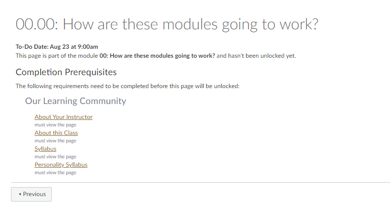

--- 
title: "Prof. Mason's Syllabi"
author: S. Mason Garrison
date: "2024-08-21"
knit: "bookdown::render_book"
site: bookdown::bookdown_site
url: 'https\://github.com/smasongarrison/syllabi'
github-repo: smasongarrison/syllabi
twitter-handle: smasongarrison
cover-image: assets/logo.png
documentclass: book
bibliography: [book.bib, packages.bib,bib/bib.bib]
biblio-style: apalike
link-citations: yes
description: "Prof. Mason's Syllabi"
favicon: assets/favicon.ico
always_allow_html: true
lot: no
lof: no
logo: assets/logo.png
---


# (PART\*) Front Matter {-}
# Welcome to my Syllabi! {-}


Welcome to all my syllabi! This website is designed to accompany all of Mason Garrison's courses at Wake Forest University. Over the semesters, I have found that my syllabi keep growing longer and longer as my career has progressed. 
I know that no one likes reading 8 page syllabi. However, I want to make sure that all my students know what my expectations are. So in that spirit, I've created a website to contain all of my policies in one place. 
That way, I can have a neat and tidy syllabi, while still making my expectations clear.

<!--chapter:end:index.Rmd-->

## How to use this syllabus {-}


This syllabus website is dynamic. If you catch typos, errors, please issue a pull request with the fixes. Unless otherwise indicidated, all the policies apply to all of my courses.


To navigate this syllabus collection, use the table of contents on the left side of the screen. You can open or close the table of contents using the hamburger icon (horizontal bars) at the top of the document. There are also additional icons at the top of the document that allow you to search the document, change the size, font, or color scheme of the page. Please note that the syllabus may be updated throughout the semester, but students are only bound to the policies in place when they signed their syllabus.


# Attributions {-}

This collection of syllabii leans on the work and ideas of other people. I have done my best to document the origin of the materials and ideas. In particular, I have noted those people whose work has been a major contribution as well as those who have additional contributions. You can view a record of any changes made to the syllabus by checking the [edit history in the git repository.](https://github.com/smasongarrison/Syllabi/commits/main)

## Major Attributions  {-}

* Jenny Bryan's ([jennybryan.org](https://jennybryan.org)) [STAT 545][stat-545]


## Additional Attributions  {-}

**Select lecture notes from:**

* Jenny Bryan's ([jennybryan.org](https://jennybryan.org/)) [STAT 545](https://stat545.com/)
* [David Funder's Personality Puzzle](https://wwnorton.com/books/The-Personality-Puzzle/)
* Anthony Albano's [Course Notes on "Introduction to Educational and Psychological Measurement"](https://www.thetaminusb.com/intro-measurement-r/)
* R. Biswas-Diener & E. Diener (Eds), Noba textbook series: Psychology. Champaign, IL: DEF publishers. Retrieved from [noba](https://nobaproject.com/)

# License {-#license}

This work is licensed under a [Creative Commons Attribution-ShareAlike 4.0 International License](https://creativecommons.org/licenses/by-sa/4.0/).

<!-- <center>
<i class="fab fa-creative-commons fa-2x"></i><i class="fab fa-creative-commons-by fa-2x"></i><i class="fab fa-creative-commons-sa fa-2x"></i>
</center>
 -->
 
* This information is a human-readable summary of (and not a substitute for) the license.
Please see https://creativecommons.org/licenses/by-sa/4.0/legalcode for the full legal text.*

**You are free to:**

- **Share**---copy and redistribute the material in any medium or
  format

- **Remix**---remix, transform, and build upon the material for any
  purpose, even commercially.

The licensor cannot revoke these freedoms as long as you follow the
license terms.

**Under the following terms:**

- **Attribution**---You must give appropriate credit, provide a link
  to the license, and indicate if changes were made. You may do so in
  any reasonable manner, but not in any way that suggests the licensor
  endorses you or your use.
  
- **ShareAlike**---If you remix, transform, or build upon the material, you must distribute your contributions under the same license as the original. 

- **No additional restrictions**---You may not apply legal terms or
  technological measures that legally restrict others from doing
  anything the license permits.

**Notices:**

You do not have to comply with the license for elements of the
material in the public domain or where your use is permitted by an
applicable exception or limitation.

No warranties are given. The license may not give you all of the
permissions necessary for your intended use. For example, other rights
such as publicity, privacy, or moral rights may limit how you use the
material.


# Colophon {-}

This syllabus was written in [bookdown](http://bookdown.org/) inside [RStudio](http://www.rstudio.com/ide/). The [website][web] is hosted with [github](https://www.github.com), The complete source is available from [github][git].

The book style adapted from [Desirée De Leon](https://desiree.rbind.io/).

This version of the syllabus was built with:


```
## Finding R package dependencies ... Done!
```

```
##  setting  value
##  version  R version 4.4.1 (2024-06-14 ucrt)
##  os       Windows 11 x64 (build 22635)
##  system   x86_64, mingw32
##  ui       RTerm
##  language (EN)
##  collate  English_United States.utf8
##  ctype    English_United States.utf8
##  tz       America/New_York
##  date     2024-08-21
##  pandoc   3.1.11 @ C:/Program Files/RStudio/resources/app/bin/quarto/bin/tools/ (via rmarkdown)
```

Along with these packages:


```{=html}
<div class="datatables html-widget html-fill-item" id="htmlwidget-9af67efd23ef49862029" style="width:100%;height:auto;"></div>
<script type="application/json" data-for="htmlwidget-9af67efd23ef49862029">{"x":{"filter":"top","vertical":false,"filterHTML":"<tr>\n  <td data-type=\"character\" style=\"vertical-align: top;\">\n    <div class=\"form-group has-feedback\" style=\"margin-bottom: auto;\">\n      <input type=\"search\" placeholder=\"All\" class=\"form-control\" style=\"width: 100%;\"/>\n      <span class=\"glyphicon glyphicon-remove-circle form-control-feedback\"><\/span>\n    <\/div>\n  <\/td>\n  <td data-type=\"character\" style=\"vertical-align: top;\">\n    <div class=\"form-group has-feedback\" style=\"margin-bottom: auto;\">\n      <input type=\"search\" placeholder=\"All\" class=\"form-control\" style=\"width: 100%;\"/>\n      <span class=\"glyphicon glyphicon-remove-circle form-control-feedback\"><\/span>\n    <\/div>\n  <\/td>\n  <td data-type=\"character\" style=\"vertical-align: top;\">\n    <div class=\"form-group has-feedback\" style=\"margin-bottom: auto;\">\n      <input type=\"search\" placeholder=\"All\" class=\"form-control\" style=\"width: 100%;\"/>\n      <span class=\"glyphicon glyphicon-remove-circle form-control-feedback\"><\/span>\n    <\/div>\n  <\/td>\n  <td data-type=\"character\" style=\"vertical-align: top;\">\n    <div class=\"form-group has-feedback\" style=\"margin-bottom: auto;\">\n      <input type=\"search\" placeholder=\"All\" class=\"form-control\" style=\"width: 100%;\"/>\n      <span class=\"glyphicon glyphicon-remove-circle form-control-feedback\"><\/span>\n    <\/div>\n  <\/td>\n<\/tr>","data":[["askpass","backports","base64enc","bigD","bit","bit64","bitops","blob","bookdown","brew","brio","broom","bslib","cachem","callr","cellranger","cli","clipr","colorspace","commonmark","conflicted","cpp11","crayon","credentials","crosstalk","curl","data.table","DBI","dbplyr","desc","devtools","dichromat","diffobj","digest","downlit","dplyr","DT","dtplyr","ellipsis","evaluate","fansi","farver","fastmap","fontawesome","forcats","fs","gapminder","gargle","gender","genderdata","generics","geonames","gert","ggplot2","gh","gitcreds","glue","googledrive","googlesheets4","gridExtra","gt","gtable","haven","highr","hms","htmltools","htmlwidgets","httpuv","httr","httr2","ids","ini","isoband","jquerylib","jsonlite","juicyjuice","knitr","labeling","later","lattice","lazyeval","lifecycle","lubridate","magrittr","markdown","MASS","Matrix","memoise","mgcv","mime","miniUI","modelr","munsell","nlme","openssl","pillar","pkgbuild","pkgconfig","pkgdown","pkgload","praise","prettyunits","processx","profvis","progress","promises","ps","purrr","R6","ragg","rappdirs","rcmdcheck","RColorBrewer","Rcpp","reactable","reactR","readr","readxl","rebird","rematch","rematch2","remotes","reprex","rlang","rmarkdown","roxygen2","rplos","rprojroot","rstudioapi","rversions","rvest","sass","scales","selectr","sessioninfo","shiny","sourcetools","stringi","stringr","sys","systemfonts","testthat","textshaping","tibble","tidyr","tidyselect","tidyverse","timechange","tinytex","tzdb","urlchecker","usethis","utf8","uuid","V8","vctrs","viridis","viridisLite","vroom","waldo","whisker","withr","xfun","xml2","xopen","xtable","yaml","zip"],[null,null,null,null,null,null,null,null,"0.39",null,null,null,"0.7.0","1.1.0",null,null,"3.6.2",null,"2.1-0",null,null,null,null,null,null,null,null,null,null,null,"2.4.5",null,null,"0.6.35",null,"1.1.4",null,null,"0.3.2","0.23","1.0.6",null,"1.2.0",null,"1.0.0","1.6.4",null,null,null,null,"0.1.3",null,null,"3.5.1",null,null,"1.7.0",null,null,null,null,"0.3.5",null,null,"1.1.3","0.5.8.1","1.6.4","1.6.15",null,null,null,null,null,"0.1.4","1.8.8",null,"1.46",null,"1.3.2",null,null,"1.0.4","1.9.3","2.0.3",null,null,null,"2.0.1",null,"0.12","0.1.1.1",null,"0.5.1",null,null,"1.9.0","1.4.4","2.0.3",null,"1.3.4",null,null,null,"0.3.8",null,"1.3.0",null,"1.0.2","2.5.1",null,null,null,null,"1.0.12",null,null,"2.1.5",null,null,null,null,"2.5.0",null,"1.1.3","2.27",null,null,null,"0.16.0",null,null,"0.4.9","1.3.0",null,"1.2.2","1.8.1.1",null,"1.8.4","1.5.1",null,null,null,null,"3.2.1","1.3.1","1.2.1","2.0.0","0.3.0",null,"0.4.0","1.0.1","2.2.3","1.2.4",null,null,"0.6.5",null,null,null,null,null,"3.0.0","0.44",null,null,"1.8-4","2.3.8",null],["2023-09-03","2024-05-23","2015-07-28","2022-09-05","2022-11-15","2020-08-30","2021-04-24","2023-03-17","2024-04-15","2023-12-16","2024-04-24","2024-05-17","2024-03-29","2024-05-16","2024-03-25","2016-07-27","2023-12-11","2022-02-22","2023-01-23","2024-01-30","2023-02-01","2023-12-02","2022-09-29","2023-09-06","2023-11-23","2024-03-01","2024-03-30","2024-06-02","2024-03-19","2023-12-10","2022-10-11",null,"2021-10-05","2024-03-11","2023-06-29","2023-11-17","2024-04-04","2023-03-22","2021-04-29","2023-11-01","2023-12-08","2024-05-13","2024-05-15","2023-08-19","2023-01-29","2024-04-25","2023-03-10","2023-07-20",null,null,"2022-07-05",null,"2023-12-04","2024-04-23","2024-03-28","2022-09-08","2024-01-09","2023-06-11","2023-06-11","2017-09-09","2024-01-17","2024-04-22","2023-11-30","2024-05-26","2023-03-21","2024-04-04","2023-12-06","2024-03-26","2023-08-15","2024-04-01","2017-05-31","2018-05-20","2022-12-20","2021-04-26","2023-12-04","2022-11-10","2024-04-06","2023-08-29","2023-12-06","2024-03-20","2019-03-15","2023-11-07","2023-09-27","2022-03-30","2024-06-04","2024-04-26","2024-04-26","2021-11-26","2023-12-21","2021-09-28","2018-05-18","2023-03-22","2024-04-01","2023-11-27","2024-05-16","2023-03-22","2024-03-17","2019-09-22","2024-04-18","2024-01-16","2015-08-11","2023-09-24","2024-03-16","2023-05-02","2023-12-06","2024-04-05","2024-01-18","2023-08-10","2021-08-19","2024-05-15","2021-01-31","2021-09-27","2022-04-03","2024-01-09","2023-03-12","2023-10-11","2024-01-10","2023-07-06",null,"2023-08-30","2020-05-01","2024-03-17","2024-01-11","2024-01-10","2024-05-17","2024-01-22",null,"2023-11-05","2024-03-24","2022-08-31","2024-02-12","2024-03-15","2023-11-28","2019-11-20","2021-12-06","2024-04-02","2023-02-01","2024-05-06","2023-11-14","2023-05-23","2024-05-15","2024-04-14","2024-05-24","2023-03-20","2024-01-24","2024-03-11","2023-02-22","2024-01-18","2024-05-06","2023-05-12","2021-11-30","2024-02-19","2023-10-22","2024-01-14","2024-02-15","2023-12-01","2024-01-29","2023-05-02","2023-12-05","2023-11-02","2022-12-05","2024-01-16","2024-05-15","2023-12-04","2024-04-25","2019-04-21","2023-12-11","2024-01-27"],["CRAN (R 4.4.0)","CRAN (R 4.4.0)","CRAN (R 4.4.0)","CRAN (R 4.4.0)","CRAN (R 4.4.0)","CRAN (R 4.4.0)","CRAN (R 4.4.0)","CRAN (R 4.4.0)","CRAN (R 4.4.0)","CRAN (R 4.4.0)","CRAN (R 4.4.0)","CRAN (R 4.4.0)","CRAN (R 4.4.0)","CRAN (R 4.4.0)","CRAN (R 4.4.0)","CRAN (R 4.4.0)","CRAN (R 4.4.0)","CRAN (R 4.4.0)","CRAN (R 4.4.0)","CRAN (R 4.4.0)","CRAN (R 4.4.0)","CRAN (R 4.4.0)","CRAN (R 4.4.0)","CRAN (R 4.4.0)","CRAN (R 4.4.0)","CRAN (R 4.4.0)","CRAN (R 4.4.0)","CRAN (R 4.4.0)","CRAN (R 4.4.0)","CRAN (R 4.4.0)","CRAN (R 4.4.0)",null,"CRAN (R 4.4.0)","CRAN (R 4.4.0)","CRAN (R 4.4.0)","CRAN (R 4.4.0)","CRAN (R 4.4.0)","CRAN (R 4.4.0)","CRAN (R 4.4.0)","CRAN (R 4.4.0)","CRAN (R 4.4.0)","CRAN (R 4.4.0)","CRAN (R 4.4.0)","CRAN (R 4.4.0)","CRAN (R 4.4.0)","CRAN (R 4.4.0)","CRAN (R 4.4.0)","CRAN (R 4.4.0)",null,null,"CRAN (R 4.4.0)",null,"CRAN (R 4.4.0)","CRAN (R 4.4.0)","CRAN (R 4.4.0)","CRAN (R 4.4.0)","CRAN (R 4.4.0)","CRAN (R 4.4.0)","CRAN (R 4.4.0)","CRAN (R 4.4.0)","CRAN (R 4.4.0)","CRAN (R 4.4.0)","CRAN (R 4.4.0)","CRAN (R 4.4.0)","CRAN (R 4.4.0)","CRAN (R 4.4.0)","CRAN (R 4.4.0)","CRAN (R 4.4.0)","CRAN (R 4.4.0)","CRAN (R 4.4.0)","CRAN (R 4.4.0)","CRAN (R 4.4.0)","CRAN (R 4.4.0)","CRAN (R 4.4.0)","CRAN (R 4.4.0)","CRAN (R 4.4.0)","CRAN (R 4.4.0)","CRAN (R 4.4.0)","CRAN (R 4.4.0)","CRAN (R 4.4.1)","CRAN (R 4.4.0)","CRAN (R 4.4.0)","CRAN (R 4.4.0)","CRAN (R 4.4.0)","CRAN (R 4.4.0)","CRAN (R 4.4.1)","CRAN (R 4.4.1)","CRAN (R 4.4.0)","CRAN (R 4.4.1)","CRAN (R 4.4.0)","CRAN (R 4.4.0)","CRAN (R 4.4.0)","CRAN (R 4.4.0)","CRAN (R 4.4.1)","CRAN (R 4.4.0)","CRAN (R 4.4.0)","CRAN (R 4.4.0)","CRAN (R 4.4.0)","CRAN (R 4.4.0)","CRAN (R 4.4.0)","CRAN (R 4.4.0)","CRAN (R 4.4.0)","CRAN (R 4.4.0)","CRAN (R 4.4.0)","CRAN (R 4.4.0)","CRAN (R 4.4.0)","CRAN (R 4.4.0)","CRAN (R 4.4.0)","CRAN (R 4.4.0)","CRAN (R 4.4.0)","CRAN (R 4.4.0)","CRAN (R 4.4.0)","CRAN (R 4.4.0)","CRAN (R 4.4.0)","CRAN (R 4.4.0)","CRAN (R 4.4.0)","CRAN (R 4.4.0)","CRAN (R 4.4.0)",null,"CRAN (R 4.4.0)","CRAN (R 4.4.0)","CRAN (R 4.4.0)","CRAN (R 4.4.0)","CRAN (R 4.4.0)","CRAN (R 4.4.0)","CRAN (R 4.4.0)",null,"CRAN (R 4.4.0)","CRAN (R 4.4.0)","CRAN (R 4.4.0)","CRAN (R 4.4.0)","CRAN (R 4.4.0)","CRAN (R 4.4.0)","CRAN (R 4.4.0)","CRAN (R 4.4.0)","CRAN (R 4.4.0)","CRAN (R 4.4.0)","CRAN (R 4.4.0)","CRAN (R 4.4.0)","CRAN (R 4.4.0)","CRAN (R 4.4.0)","CRAN (R 4.4.0)","CRAN (R 4.4.0)","CRAN (R 4.4.0)","CRAN (R 4.4.0)","CRAN (R 4.4.0)","CRAN (R 4.4.0)","CRAN (R 4.4.0)","CRAN (R 4.4.0)","CRAN (R 4.4.0)","CRAN (R 4.4.0)","CRAN (R 4.4.0)","CRAN (R 4.4.0)","CRAN (R 4.4.0)","CRAN (R 4.4.0)","CRAN (R 4.4.0)","CRAN (R 4.4.0)","CRAN (R 4.4.0)","CRAN (R 4.4.0)","CRAN (R 4.4.0)","CRAN (R 4.4.0)","CRAN (R 4.4.0)","CRAN (R 4.4.0)","CRAN (R 4.4.0)","CRAN (R 4.4.0)","CRAN (R 4.4.0)","CRAN (R 4.4.0)","CRAN (R 4.4.0)"]],"container":"<table class=\"cell-border stripe\">\n  <thead>\n    <tr>\n      <th>package<\/th>\n      <th>loadedversion<\/th>\n      <th>date<\/th>\n      <th>source<\/th>\n    <\/tr>\n  <\/thead>\n<\/table>","options":{"pageLength":168,"autoWidth":true,"bInfo":false,"paging":false,"columnDefs":[{"name":"package","targets":0},{"name":"loadedversion","targets":1},{"name":"date","targets":2},{"name":"source","targets":3}],"order":[],"orderClasses":false,"orderCellsTop":true,"lengthMenu":[10,25,50,100,168]},"selection":{"mode":"multiple","selected":null,"target":"row","selectable":null}},"evals":[],"jsHooks":[]}</script>
```

The R session information when compiling this book is shown below:


``` r
sessionInfo()
```

```
## R version 4.4.1 (2024-06-14 ucrt)
## Platform: x86_64-w64-mingw32/x64
## Running under: Windows 11 x64 (build 22635)
## 
## Matrix products: default
## 
## 
## locale:
## [1] LC_COLLATE=English_United States.utf8 
## [2] LC_CTYPE=English_United States.utf8   
## [3] LC_MONETARY=English_United States.utf8
## [4] LC_NUMERIC=C                          
## [5] LC_TIME=English_United States.utf8    
## 
## time zone: America/New_York
## tzcode source: internal
## 
## attached base packages:
## [1] stats     graphics  grDevices utils     datasets  methods   base     
## 
## other attached packages:
##  [1] lubridate_1.9.3 forcats_1.0.0   stringr_1.5.1   dplyr_1.1.4    
##  [5] purrr_1.0.2     readr_2.1.5     tidyr_1.3.1     tibble_3.2.1   
##  [9] ggplot2_3.5.1   tidyverse_2.0.0
## 
## loaded via a namespace (and not attached):
## [1] tools_4.4.1       htmltools_0.5.8.1 bookdown_0.39     rmarkdown_2.27   
## [5] shiny_1.8.1.1     knitr_1.46        miniUI_0.1.1.1
```


<!--class Links-->
[web]: https://smasongarrison.github.io/syllabi
[git]: https://github.com/smasongarrison/syllabi
[slides]: https://github.com/DataScience4Psych/slides
[edits]: https://github.com/smasongarrison/syllabi/commits/main
<!-- keep-->

[stat-545]: https://stat545.com
[jennybryan]: https://jennybryan.org

[albano-class]: https://www.thetaminusb.com/intro-measurement-r/
[noba]: https://nobaproject.com/
[ytplaylist]: https://ytplaylist-len.herokuapp.com/

<!--chapter:end:0000_front.Rmd-->

# (PART\*) Syllabi {-}

# General information {-}


<!--class Links-->
[web]: https://smasongarrison.github.io/syllabi
[git]: https://github.com/smasongarrison/syllabi
[slides]: https://github.com/DataScience4Psych/slides
[edits]: https://github.com/smasongarrison/syllabi/commits/main
<!-- keep-->

[stat-545]: https://stat545.com
[jennybryan]: https://jennybryan.org

[albano-class]: https://www.thetaminusb.com/intro-measurement-r/
[noba]: https://nobaproject.com/
[ytplaylist]: https://ytplaylist-len.herokuapp.com/

Welcome! This section includes general information on the syllabus. The following sections include information specific to your class. (Now, before I forget, any matter not explicitly covered by the syllabus or institution-wide policy is left to my sole discretion as the instructor. See [policy overview](#policy-overview)

Remember: This course is for you, not for me. 


```{=html}
<div class="vembedr" align="center">
<div>
<iframe src="https://www.youtube.com/embed/aL_fP5axQV4" width="533" height="300" frameborder="0" allowfullscreen="" data-external="1"></iframe>
</div>
</div>
```

Credit: 


```{=html}
<blockquote class="twitter-tweet" data-width="550" data-lang="en" data-dnt="true" data-theme="light"><p lang="en" dir="ltr">“Read the syllabus” - <a href="https://twitter.com/SnoopDogg?ref_src=twsrc%5Etfw">@SnoopDogg</a> <a href="https://t.co/RXHvAB5ryO">https://t.co/RXHvAB5ryO</a></p>&mdash; Shit Academics Say (@AcademicsSay) <a href="https://twitter.com/AcademicsSay/status/1293621452684644355?ref_src=twsrc%5Etfw">August 12, 2020</a></blockquote>

```

## Materials

If you chose to use alternative materials, such as an older edition of the book, it is your responsibility to ensure that those materials are equivalent.

### Required Texts

For all of my classes, the textbook is intended to supplement the course. The lectures do not follow the order of chapters in the text and the text covers some material that will not be covered in the lectures, i.e., not all the information in each chapter is perfectly pertinent to the course requirements. 

It is one of many resources you'll consume. 
You probably need to consume all of the resources that I provide in order to be successful in this class. If you'd like to make the most of your tuition, I strongly encourage you to consume them all. Course-specific resources can be found on the specific course page.

### Hardware

Most of my classes require you to have a computer that can run R and stream YouTube videos.

### Software

#### R and RStudio


```{=html}
<div class="vembedr" align="center">
<div>
<iframe src="https://www.youtube.com/embed/kVIZGCT5p9U" width="533" height="300" frameborder="0" allowfullscreen="" data-external="1"></iframe>
</div>
</div>
```


R is a free software environment for statistical computing and graphics. It compiles and runs on a wide variety of UNIX platforms, Windows, and MacOS.

RStudio is a free _integrated development environment_ (IDE), a powerful user interface for R.

#### Git and Github

Git is a version control system. Its original purpose was to help developers work collaboratively on big software projects. Git manages the evolution of a set of files – called a repository – in a structured way. Think of it like the "Track Changes" feature from Microsoft Word.

Github is a free IDE and hosting service for Git. As a Wake Forest student, you should be able to access the [GitHub Student Developer Pack for free](https://education.github.com/benefits?type=student). It includes a free PRO upgrade for your github account.

<!--chapter:end:0100_syllabus.Rmd-->

# (PART\*) Policies {-}


# Policy Overview

In this section, I provide specific language for all of my course policies. These policies are in addition to the policies and procedures outlined in the university [bulletin](https://bulletin.wfu.edu). There are slight differences between the [undergraduate college](https://bulletin.wfu.edu/undergraduate/) and the [graduate school](https://bulletin.wfu.edu/graduate/). 


## Changes

This syllabus is intended to provide the student with guidance on what may be covered during the semester and will be followed as closely as possible. The dates for tests and assignments will not change except for extraordinary events. I reserve the right to modify, supplement, and make changes as the course needs arise. I try to avoid making changes to the syllabus. However, if substantive changes occur, I will only make changes that are less burdensome and more advantageous to the students. (If I make a change that increases your burden, please talk to me so that we can find a solution.)

### Interpretation

If any policies in this syllabus require interpretation, the instructor's determination is final. That determination will be consistent with the original intent of the policy. Clarifications and interpretations will be committed to the syllabus github repo to codify the document's intent.

<!--chapter:end:0101_policies.Rmd-->


# Class Engagement

In previous semesters, I have had a deliberately hard-line attendance policy. 
In light of the public health crisis, I have done away with this policy, as it does not align with my general philosophy of treating students as junior colleagues. (It also does not align with my goal of making it through the pandemic without getting COVID... yay, high risk of complications)

Class engagement points are given to encourage your active engagement with the material. 
Specific instructions for engagement can be found on the class website. In general, you will be rewarded with a perfect score as long as you engage meaningfully, intentionally, and professionally with the material and your peers. As a reminder, you are still responsible for any assignments and/or announcements made if you miss a class.


## Life Happens

As a reasonable and empathetic human, I recognize that life happens. There will be times when your outside life conflicts with scheduled class events. These life events can be any of the obvious things (sports, religious holidays, illness, interviews, etc.), but they can also be the less obvious things, like spending the entire night looking for your lost pet. My general approach is to work with you. You just need to let me know *ahead* of time. These late policies value discussion and communication over deductions and punishment. 
It is difficult for me as an instructor to know your situation and reason for lateness (e.g. are you sick? did you lose WiFi? struggling with mental health? or just forgot?). Without communication, I will assume that you are choosing not to submit work and do not plan on submitting work. An email will help me better understand your needs and focus on coursework. I am more than happy to give extensions and accommodations, so don't be afraid to email me. You don't need to disclose personal details (your privacy is important to me), so a heads up or request for assistance is enough.


##  Extensions, Absences, Incompletes

### Excused absences

Except in the case of *true* emergencies, a possible excused absence should be discussed with me as far in advance as possible and *must* occur beforehand. 
You should not assume that an excused absence will automatically be granted -- but you may assume that I am a reasonable, empathetic person. 
This discussion should occur via email so that we have a record of it.
If you also discuss your situation verbally, send me a summary of the discussion by email. 
An unexcused absence will result in a zero for any graded work that should have been performed for or during the missed class. 


### Late Work

+ Be sure to pay close attention to deadlines. 
+ If an assignment is not submitted by the deadline (i.e., is late), the student must email the instructor and provide a new deadline, ask for an alternative, or explain concerns *within 36 hours* of the missed deadline. 
+ Ideally, you will have communicated with me before the deadline, but sometimes life happens. 
+ As long as you have communicated *within 36 hours*, I will do my best to work with you to come up with a new deadline or modification, so that you can earn full credit. + Any modification or change of deadline must be confirmed in writing. And must be done for each modification.
+ This late policy does not apply to exams, tests, or quizzes. 

If contact is not made *within 36 hours* of the missed deadline, the missing assignment will receive a 0 and cannot be made up. 

Alternative deadlines will be within one week of the original deadline. 

Exceptions to the 1 week policy are at the instructor's discretion. Exceptions are rare.

In general, I am much more sympathetic and accommodating if you communicate in advance.

#### Submissions

It is your responsibility to ensure that the instructor has received the assignment by the established due date and to ensure that the assignment submitted is the complete and correct version. 

Unless otherwise explicitly specified, all work must be submitted through Canvas.

Unless you have communicated with me in advance, there will be no makeup quizzes or tests.


### Incomplete Grades

I did not make this policy. However, I must abide by it.

Although the language surrounding incomplete grades differs slightly across the bulletins ( [undergraduate](https://bulletin.wfu.edu/undergraduate/procedures/exams-grading/#:~:text=Incomplete%20Grade); [graduate](https://bulletin.wfu.edu/graduate/procedures/grading/#:~:text=Grade%20of%20I)), and office of [academic advising]( https://advising.wfu.edu/academic-challenges/incompletes/), the intent is consistent. 
Incompletes can only be granted IF a student fails to complete the work of a course because of something outside of the student's control, such as an illness, emergency, or extenuating circumstances. The window to complete the work is narrow, typically 30 days into the next semester. If the work is not completed after that point, the grade is automatically changed to an F. 

<!--chapter:end:0102_engagement.Rmd-->


# Accommodations Policy

If you are (or become) disabled (in any capacity, permanently, or temporarily), and need accommodations in class, reading, or any other work in this course, please contact me to discuss your specific needs as soon as possible. 
Under my favorite civil rights legislation, the Americans with Disabilities Act as amended you are legally entitled to reasonable accommodations for disabilities. In fact, Section 504 of the Rehabilitation Act of 1973, the [Americans with Disabilities Act (ADA) of 1990](https://beta.ada.gov/), and the [ADA Amendments Act (ADAAA) of 2008](https://en.wikipedia.org/wiki/ADA_Amendments_Act_of_2008) all prohibit discrimination against individuals with disabilities.
I will do everything in my capacity as your professor to ensure that you receive those accommodations. 

Students who need reasonable accommodations for disabilities also should contact the Center for Learning, Access, and Student Success  (118 Reynolda Hall, 336-758-5929,  [class.wfu.edu](https://class.wfu.edu/)). You can request accommodations through the [student portal (olympic.accessiblelearning.com/WFU/)](https://olympic.accessiblelearning.com/WFU/) These accommodations are not retroactive. Therefore, I strongly encourage you to use those accommodations.  As a member of CLASS's faculty advising board, I am happy to connect you with CLASS and talk to you more if you have questions. (However, please note that I am a quantitative Psychologist, not a clinical psychologist. My expertise stems from lived experience.)

Do not feel guilty about using them. 
You rightfully deserve them, in the legal, moral, and ethical sense. 
These accommodations are there so that you can be your best possible self. 


## Self-Advocacy

At Wake Forest and at many other places, the expectation is that you will self-advocate for yourselves and know exactly what you need. Is that a good expectation? Is that a good model? Is that equitable? I have thoughts... regardless, that is the current state of the world. Accordingly, you will have to advocate for what you need. If this process seems daunting, please talk to me! Regardless, I am happy to talk with you about this process and to share my own experiences.


```{=html}
<blockquote class="twitter-tweet" data-width="550" data-lang="en" data-dnt="true" data-theme="light"><p lang="en" dir="ltr">I’ve learned that self advocacy is a privilege. Often times the necessity of good communication skills, time, resources, and education are needed. These tools are not always inclusive to individuals with disabilities. This is why allyship is so vital for disability empowerment.</p>&mdash; R.Dopson, MPH (@Rasheeradiara) <a href="https://twitter.com/Rasheeradiara/status/1532760383500472326?ref_src=twsrc%5Etfw">June 3, 2022</a></blockquote>

```


As a student, you may not know what accommodations work best for you. Or you may find that your current accommodations don't work like they used to. 

As you journey thru your career, you may find that you need different kinds of accommodations. Or at least that has been my experience... There are numerous resources for ideas. 
My personal favorite is [JAN](https://askjan.org/). Technically, JAN (Job Accommodation Network) is focused on employment and jobs. 
However, I still have found this to be a wonderful resource for ideas. 
You can [search for accommodation ideas](https://askjan.org/soar.cfm) by [specific](https://askjan.org/a-to-z.cfm):

  - disability,
  - limitation,
  - task,
  - topic, or
  - accommodation.

## Resources

* [Frequently Asked Questions from WFU CLASS](https://class.wfu.edu/frequently-asked-questions-students/)
* [JAN](https://askjan.org/)
* [American Psychological Association's DisABILITY Resources Toolbox (DART)](https://www.apa.org/pi/disability/dart/)
* [WFU Self-advocacy handout](https://docs.google.com/document/d/1X44zJyTz8-s9t6IXw0bII2DCFiOk1NR2MRfTi8wBiIc/)
* [College Foundation of North Carolina's Know Your Rights](https://www.cfnc.org/plan-your-future/plan-for-college/students-with-disabilities/know-your-rights/)

# Classroom Climate

I aim to create a learning environment for my students that supports a diversity of thoughts, perspectives, and experiences, and honors your identities (including but not limited to race, ethnicity, sex, gender, gender-identity, class, culture, sexual orientation, religion, disability, political affiliation, military status). To help accomplish this:

- If you have a name or set of pronouns that differ from those that appear in your official records, please let me know!

- If you feel like your performance in the class is being impacted by your experiences outside of class, please don't hesitate to come and talk with me. I can direct you to resources

- I (like many people) am still in the process of learning about diverse perspectives and identities. If something was said in class (by anyone) that made you feel uncomfortable, please talk to me about it. 

- If you reached here in the syllabus, e-mail me a picture of a cat. If you do it before the end of the first week, you get a small bonus. (And even if its after the first week, feel free to still send me a cat picture.)

<!--
## Statements

### From the psychology department
The Psychology Department values, respects, and celebrates the experiences, beliefs, and practices stemming from varied cultures and circumstances (emphasizing, but not limited to, those from historically underrepresented groups),and our deep commitment to diversity, equity, and inclusion plays out through coursework, programming by majors, and research. 

### How I'd expand it
The Psychology Department values, respects, and celebrates the experiences, beliefs, and practices stemming from varied cultures and circumstances ( emphasizing, but not limited to, those from marginalized groups, including those historically underrepresented). We center our department around our deep commitment to diversity, equity, inclusion, and access. That deep commitment plays out through coursework, programming by majors, service, outreach, and research. 
 -->

<!--chapter:end:0103_idea.Rmd-->

# Academic Honesty Policy

In this course, you will be held to the standards of the Wake Forest Honor Code, a code that you pledged to honor when you signed your application for admission to the institution. 
If you are unfamiliar with the details of this code and how it is administered, you should consult the [Honor System Handbook](https://studentconduct.wfu.edu/honor-system-wfu/). 
That handbook outlines the University's expectations for the integrity of your academic work, the procedures for resolving alleged violations of those expectations, and the rights and responsibilities of students and faculty members throughout the process.

All submitted work must be your own. It is your responsibility to avoid even the appearance of cheating.

Unless I have explicitly stated otherwise, every assessment is closed to outside resources (including, but not limited to books, notes, phones, people, Chegg, ChatGPT, the internet). Ignorance of the honor code and assignment instructions is not an acceptable explanation or defense. 

## Violations

Violations of this policy result in a zero for the assignment, my perpetual disappointment, and possible additional penalties and disciplinary actions, including, but not limited to:

- a referral to honor council, 
- failing the class,
- a forensic regrading of all previous assessments,
- forfeiting all extra credit, and
- being excluded from the course curve, drop policy, late policy, and extra credit.


## Ethical Use of Artificial Intelligence
Note: This policy's language was adapted from this [reddit post](https://www.reddit.com/r/Professors/comments/11mmz8k/the_ethical_use_of_artificial_intelligence/)

As artificial intelligence becomes more prevalent in our daily lives, it is crucial for students to understand the ethical considerations surrounding its use in academic settings. In my courses, I expect students to use AI in a manner that aligns with the values of academic integrity. In general, the use of AI should never compromise development in critical thinking, research, and analysis. Along that line, the use of AI to generate content, manipulate the tone of work, or create data is considered academic dishonesty and strictly prohibited.

<!--
However, students are encouraged towards using AI to assist in the research and writing process in ways which encourage the learning process, mitigate menial tasks, or accommodate disabilities. For example, I use AI to enhance my speech recognition software and [other assistive software that I have written](https://github.com/smasongarrison/AutoHotKey_Scripts). In that spirit, I think students may use AI to develop personalized learning and reading plans. I consider receiving AI assistance with grammar and spelling errors is akin to using Grammarly, a tool that helps users improve their writing skills.
-->

Please note that any unethical use of AI in my courses will be considered academic dishonesty and may result in disciplinary action. Students are responsible for ensuring that their use of AI is in compliance with the course policies on academic integrity.


## Common Sense

To be clear, even if something is NOT explicitly forbidden in this document, that does not mean it is allowed. Please use your common sense here. If a reasonable person would consider it cheating, it is cheating. 

### Things that I thought didn't need to be said, but apparently did need to be said.

Everything must be in your own words, regardless of any open-resource policy. 
Open resources does not mean that you can copy and paste material from outside sources (or from course sources) directly into an assessment. Assessments are not scavenger hunts.  Assessments are a means for you to demonstrate your own understanding of the material. They are an opportunity to earn points through the demonstration of knowledge.


#### It is *ALWAYS* academic dishonesty...

- It is *ALWAYS* academic dishonesty to copy outside materials directly into a test or quiz. 

- It is *ALWAYS* academic dishonesty to copy lecture notes directly into a test or quiz.

- It is *ALWAYS* academic dishonesty to copy powerpoint slides directly into a test or quiz.

- It is *STILL* dishonest if you indirectly copy outside materials into a test or quiz.

- It is *STILL* dishonest if you then edit what you have copied. Frankly that is worse because you tried to hide that you did it.

- It is *ALWAYS* academic dishonesty to share test questions.  

- It is *ALWAYS* academic dishonesty to post course materials on any third-party websites. 

- It is *ALWAYS* academic dishonesty to misrepresent others work as your own.  

- It is *ALWAYS* academic dishonesty to work together on tests or quizzes. (And frankly, it is really obvious in Canvas when you work together. I literally wrote a R program that checks for working together on tests. )


<!--chapter:end:0104_honesty.Rmd-->

# Communication

Be mindful that there is a person on the other end of your request -- me. I'm a person. So please be intentional with your emails and recognize that my time in finite. It is in everyone's best interest that I spend my time engaging with students in meaningful ways, not pointing you to material you can find on your own. Be sure to check the syllabus, course website, course content, and classmates before emailing me. This practice is important training for life after college – when you have a question, the first thing you do should not be to email your boss. I do not want to discourage you from engaging with me. I love teaching because I love interacting with students. However, I do not want to engage with you in ways that nurture your inability to critically think and prevents me from engaging with other students. 

If you are ever uncertain about the purpose of an assignment, the learning objectives of an activity, or how an assessment will be graded, please reach out. My goal is to be  organized, thoughtful, and transparent. All my assignments were thoughtfully chosen. There is no busy work or unnecessary required course material^[even the engagement activities serve a clear purpose]. If I have done a poor job explaining the motivation for any aspect of my course, please let me know so I can be more clear. 


## Minimums

You are expected to read every LMS announcement, message, and email, as well as view the media embedded within those communications. Students are expected to check e-mail on a frequent and regular basis in order to stay current with University-related communications. Please recognize that certain communications may be time-critical. At minimum, you should be checking your communications within 24 hours. Ignorance of a class communication is not grounds for an excused absence or extension. 


### Self Advocacy

If you are struggling in this class, please talk to me. Do not assume that I know what is going on in your life. Talk to me and tell me what you need.

### Requests for Re-Assessment

Please send any questions about grades in writing via email within *one* week after the assignment is returned. If I erred in scoring or in calculating the grade, I will happily update the record. Otherwise, I will be most receptive toward questions framed in terms of your learning (rather than simply your performance), as research has shown that focusing overly on extrinsic rewards (like grades) is likely to lead to all sorts of outcomes that I don't wish for you (lower interest in the course material, lower learning, lower enjoyment).

<!--
You may request a re-assessment of any graded work in this course, subject to the following conditions:

- The request for re-assessment must be made by email within one (1) working week of the grade being released to you.

- You must provide a written rationale for requesting re-assessment, specifically referencing the learning outcomes, assessment rubric, qualitative grade descriptors, and any written feedback provided to you.

- The item being re-assessed must have a material impact on your overall course grade. 
- The full item being re-assessed will be completely re-assessed using the rubric and your grade may remain unchanged, increase, or decrease as a result of re-assessment.
-->
## Instructor Availability

I am readily accessible during business hours (9:00AM-5:30PM; Monday-Friday) via [email](garrissm@wfu.edu)/ LMS/ git/ zoom/ carrier pigeon/[calendly](https://calendly.com/smasongarrison/). Outside those hours, I do not typically respond to messages, in order to devote time to my family, rest, and living my life. Messages received during these times will receive attention once I am back online. Otherwise you can expect to receive a response to your message within 12 to 24 hours, often much sooner. If you do not hear back after 36 hours, please follow-up with me. 

I have given out my cell-phone number, in the case of *true* emergencies. Please be mindful that poor planning on your part does not constitute an emergency for me. 

### Is it a true emergency?

How do you know if it is a true emergency? 

* Ask yourself, would a reasonable person consider this situation an emergency? 
* How would the situation change if you waited until morning?
* Could this situation have been prevented by starting earlier?
* Would Professor Mason really want to know about this situation *right* now? 
* If you were in Professor Mason's shoes, would you consider this an emergency?

## Recordings

### Recording of Class Sessions. 

All or some in-person and synchronous classes may be recorded.  Student images and voices may be captured in these recordings. I will do my best to protect that information from being shared outside the confines of the class. Recordings with students in them will be available for viewing only by students enrolled in the class via Canvas or an alternative platform. The recordings are intended to improve access to course content. No other recording, including by students, is permitted without explicit permission. (Recordings for notetaking or accommodations are typically permitted. Just chat with me about it.)

### Recording Tails in our Synchronous Classes. 

Synchronous class recordings may include events that happen before class officially begins or after it officially ends. Students should take care to not discuss any confidential matters during these periods of time.

### Access to Recordings. 

Students may access the class recordings made available to them solely for the purpose of participating in the course. The recordings may not be used by any person other than a student enrolled in the course or for any purpose other than to participate in the course. Students are prohibited from downloading or distributing any portion of the recordings for any purpose. Students should understand that technical problems or human error may prevent successful recording.

### Copyright Notice. 

Students are advised that Wake Forest University faculty members hold the copyright in their course materials. The University and the faculty have legal rights in class recordings.

<!--chapter:end:0105_communcation.Rmd-->

# (PART\*) Specific Courses {-}


<!--class Links-->
[web]: https://smasongarrison.github.io/syllabi
[git]: https://github.com/smasongarrison/syllabi
[slides]: https://github.com/DataScience4Psych/slides
[edits]: https://github.com/smasongarrison/syllabi/commits/main
<!-- keep-->

[stat-545]: https://stat545.com
[jennybryan]: https://jennybryan.org

[albano-class]: https://www.thetaminusb.com/intro-measurement-r/
[noba]: https://nobaproject.com/
[ytplaylist]: https://ytplaylist-len.herokuapp.com/


<!--chapter:end:0200_specificcourses.Rmd-->

# 255: Personality {-#personality}


## Course Description   {-}

This class provides a survey of theory and research on the structure and function of human personality, with attention to the relationship to cognition, emotion, motivation, and behavior. It requires P-PSY 151. In addition, we will discuss other individual differences, such as intelligence.

### Broad goals for the course:   {-}
- 1. The first is for you to understand what personality psychologists think. We will cover classic and current theories, research, and applications of Personality psychology.
- 2. The second is for you to learn how personality psychologists study their field scientifically. We will discuss the procedures used to test theories and to study issues related to personality.
- 3. The third is to (hopefully) recognize some relevance of personality psychology for your personal and professional life.


## Required Materials   {-}

[1] D. C. Funder. _The personality puzzle_. Seventh. OCLC: 935283402.
New York: W.W. Norton & Co., 2016. ISBN: 978-0-393-60042-1.


## Course Assignments   {-}

### Quizzes    {-}
There will be 6 quizzes in this course. The best 5 out of 6 quizzes grades will be used to determine your total quiz grade.  You can drop any of the quizzes for any reason BUT YOU MUST PASS THE LAST Quiz ( that is held during the university scheduled final exam period).  If you do not pass the final quiz, your score on that quiz will count as one of your 5 grades. If you do pass the final quiz, then the best 5 grades will be used (irrespective of your score on the final quiz).


#### Quiz Dates   {-}

- Quiz 1: Friday, 09/09

- Quiz 2: Friday, 09/30

- Quiz 3: Friday, 10/28

- Quiz 4: Friday, 11/18

- Quiz 5: Friday, 12/02

- Quiz 6: During Finals, 12/09


### Short Assignments   {-}

There will be  3 short assignments in this course. These assignments will allow you to incorporate some of your own interests into the course. Such interests could be related to your career, another class you're taking, a hobby you're exploring, or some other random fancy. They will typically be approximately two (2) pages. I will provide more specific written guidelines at least two weeks before each assignment is due.


The best  2 out of  3 short assignments will be used to determine your total short assignments.  You can skip one of the assignments for any reason.


#### Short Assignment Dates   {-}

- Assignment 1: Friday, 10/07: Critique of an online personality test.

- Assignment 2: Friday, 11/11: Critique of a personality-related media article.

- Assignment 3: Friday, 12/09: Critique of a personality-related YouTube video.

### Engagement Activities   {-}

There will be multiple engagement activities in this course. These activities will allow you engage with the material for each module. Details about the specific activities will be provided on canvas. Students must complete two activities per module. For students in the blended section, they can attend their weekly in-person session and count it as an engagement activity.


## Grading Policy   {-}


Typically, an A- is defined as 90% of the highest point total in the class, B- as 80% of that total, C- as 70 and D- as 60%.
I may shift these values down to provide a better fit to the actual point distribution.
By scaling to a percentage of the highest point total in the class, each student has a much better chance of receiving higher grades than if no re-scaling were done.
This curve can only help your grade.

The full table is provided below:

Table: (\#tab:unnamed-chunk-7)Full Table

|Letter | Cutoff|
|:------|------:|
|A      |   0.95|
|A-     |   0.90|
|B+     |   0.87|
|B      |   0.83|
|B-     |   0.80|
|C+     |   0.77|
|C      |   0.73|
|C-     |   0.70|
|D+     |   0.67|
|D      |   0.63|
|D-     |   0.60|

### Curve Projections    {-}

Unsurprisingly, students have many questions about the curve in this class. For tests and other assignments, I try to provide a projected letter grade.
This projected letter grade is there to give you a sense of what your score *would* be if I implemented the class curve on this particular assignment.
It is a projection. It is not a guarantee. These projected letter grades are not incorporated into your final grade.
Trust me, you do not want me to curve by assignment.


### Weighting   {-}

- 150 points of your grade will be determined by your best 5 quizzes
    - The final is not optional.
- 25 points of your grade will be determined by completing engagement activities.
- 100 points of your grade will be determined by your best two short assignments.


## Schedule {-}


```{=html}
<div class="datatables html-widget html-fill-item" id="htmlwidget-e04276dc5f6bb01b4794" style="width:100%;height:auto;"></div>
<script type="application/json" data-for="htmlwidget-e04276dc5f6bb01b4794">{"x":{"filter":"none","vertical":false,"data":[[1,2,3,4,5,6,7,8,9,10,11,12,13,14,15,16],["08/22","08/29","09/05","09/12","09/19","09/26","10/03","10/10","10/17","10/24","10/31","11/07","11/14","11/21","11/28","12/05"],["What is Personality","Personality Research Methods","Assessment, Evaluation, and Ethics","Trait Approach and Personality Judgment","Big Five","Personality over the Lifespan","Biological Approaches to Psychology","Behavior Genetics","Evolutionary Psychology","Cross-Cultural Psychology","Freud","Psychoanalysis After Freud","Personality Processes and Positive Psych","MiniModule on Personality, Big Data, and AI (Also, Thanksgiving Break!)","Personality and Health",null],["Week 01, 08/22 - 08/26","Week 02, 08/29 - 09/02","Week 03, 09/05 - 09/09","Week 04, 09/12 - 09/16","Week 05, 09/19 - 09/23","Week 06, 09/26 - 09/30","Week 07, 10/03 - 10/07","Week 08, 10/10 - 10/14","Week 09, 10/17 - 10/21","Week 10, 10/24 - 10/28","Week 11, 10/31 - 11/04","Week 12, 11/07 - 11/11","Week 13, 11/14 - 11/18","Week 14, 11/21 - 11/25","Week 15, 11/28 - 12/02","Week 16, 12/05 - 12/09"],[null,null,"Quiz",null,null,"Quiz","Assignment",null,null,"Quiz",null,"Assignment","Quiz",null,"Quiz","Quiz and Assignment"]],"container":"<table class=\"cell-border stripe\">\n  <thead>\n    <tr>\n      <th>module<\/th>\n      <th>start<\/th>\n      <th>topic<\/th>\n      <th>week<\/th>\n      <th>milestones<\/th>\n    <\/tr>\n  <\/thead>\n<\/table>","options":{"autoWidth":false,"bInfo":false,"paging":false,"columnDefs":[{"className":"dt-right","targets":0},{"name":"module","targets":0},{"name":"start","targets":1},{"name":"topic","targets":2},{"name":"week","targets":3},{"name":"milestones","targets":4}],"order":[],"orderClasses":false},"selection":{"mode":"multiple","selected":null,"target":"row","selectable":null}},"evals":[],"jsHooks":[]}</script>
```


<!--chapter:end:0201_personality.Rmd-->

# 310: Methods in Psych Research {-#statsminor}


## Course Description  {-}

Methods in Psychological Research introduces statistics and research design for students minoring in psychology. Prereq: P—PSY 151 (D, QR)

This course is designed to help students develop the conceptual background and practical skills necessary to evaluate the statistics encountered in their coursework and in everyday life. It emphasizes selection, application, and interpretation. Topics to be covered include statistical inference, probability distributions, sampling, hypothesis testing, and correlation. The goal will be to go beyond rote memorization of abstract formulas and for students to develop an appreciation for the critical role that statistics plays in psychological science.


## Required Materials  {-}

Morling, Research Methods in Psychology https://wwnorton.com/books/9780393893724


## Course Assignments  {-}
### Grading Policy   {-}


Typically, an A- is defined as 90% of the highest point total in the class, B- as 80% of that total, C- as 70 and D- as 60%.
I may shift these values down to provide a better fit to the actual point distribution.
By scaling to a percentage of the highest point total in the class, each student has a much better chance of receiving higher grades than if no re-scaling were done.
This curve can only help your grade.

The full table is provided below:

Table: (\#tab:unnamed-chunk-5)Full Table

|Letter | Cutoff|
|:------|------:|
|A      |   0.95|
|A-     |   0.90|
|B+     |   0.87|
|B      |   0.83|
|B-     |   0.80|
|C+     |   0.77|
|C      |   0.73|
|C-     |   0.70|
|D+     |   0.67|
|D      |   0.63|
|D-     |   0.60|

### Curve Projections    {-}

Unsurprisingly, students have many questions about the curve in this class. For tests and other assignments, I try to provide a projected letter grade.
This projected letter grade is there to give you a sense of what your score *would* be if I implemented the class curve on this particular assignment.
It is a projection. It is not a guarantee. These projected letter grades are not incorporated into your final grade.
Trust me, you do not want me to curve by assignment.


### Quizzes   {-}

There will be 14 multiple-choice reading quizzes (effectively these are weekly). The best 12 out of 14 quiz grades will be used to determine your total quiz grade.  You can drop 2 of the quizzes for any reason.

### Exams   {-}

There will be 3 exams. The best 2 out of 3 exam grades will be used to determine your total exam grade.  You can drop 1 of the exams for any reason.


#### Exams Dates   {-}

- Exam 1: Friday, 09/27

- Exam 2: Friday, 11/15

- Exam 3: During Finals, 12/20


### Short Assignments   {-}

There will be 2 short assignments in this course. These assignments will allow you to incorporate some of your own interests into the course. Such interests could be related to your career, another class you're taking, a hobby you're exploring, or some other random fancy. They will typically be approximately two (2) pages. I will provide more specific written guidelines at least two weeks before each assignment is due.


The best 1 out of 2 short assignments will be used to determine your total short assignments.  You can skip one of the assignments for any reason.


#### Assignment Dates   {-}

- Assignment 1: Friday, 10/18: Qualitative Critique 1

- Assignment 2: Friday, 12/13: Qualitative Critique 2


## Engagement Activities   {-}

There will be multiple engagement activities in this course. These activities will allow you engage with the material for each module. Details about the specific activities will be provided on canvas. Students must complete two activities per module.


## Grading Weighting   {-}

- 200 points of your grade will be determined by your best 2 exams.
- 50 points of your grade will be determined by your best 1 assignment(s).
- 25 points of your grade will be determined by your engagement.
- 60 points of your grade will be determined by your best 12 quizzes.


## Schedule  {-}


```{=html}
<div class="datatables html-widget html-fill-item" id="htmlwidget-2f9cf98f22e02559f55f" style="width:100%;height:auto;"></div>
<script type="application/json" data-for="htmlwidget-2f9cf98f22e02559f55f">{"x":{"filter":"none","vertical":false,"data":[[1,2,3,4,5,6,7,8,9,10,11,12,13,14,15,16,17],["08/26","09/02","09/09","09/16","09/23","09/30","10/07","10/14","10/21","10/28","11/04","11/11","11/18","11/25","12/02","12/09","12/16"],["Introduction","Statistical Foundations","Describing Data with R","Univariate Distributions","Bivariate Distributions","Probability Theory","Binomials and other sampling distributions","Hypothesis Testing","Spring Break","T-Tests","Regression","Causal Inference","ANOVA","Applications in R","Applications in R","Review","NA"],["Week 01, 08/26 - 08/30","Week 02, 09/02 - 09/06","Week 03, 09/09 - 09/13","Week 04, 09/16 - 09/20","Week 05, 09/23 - 09/27","Week 06, 09/30 - 10/04","Week 07, 10/07 - 10/11","Week 08, 10/14 - 10/18","Week 09, 10/21 - 10/25","Week 10, 10/28 - 11/01","Week 11, 11/04 - 11/08","Week 12, 11/11 - 11/15","Week 13, 11/18 - 11/22","Week 14, 11/25 - 11/29","Week 15, 12/02 - 12/06","Week 16, 12/09 - 12/13","Week 17, 12/16 - 12/20"],[null,null,null,null,"Exam",null,null,"Assignment",null,null,null,"Exam",null,null,null,"Assignment","Exam"]],"container":"<table class=\"cell-border stripe\">\n  <thead>\n    <tr>\n      <th>module<\/th>\n      <th>start<\/th>\n      <th>topic<\/th>\n      <th>week<\/th>\n      <th>milestones<\/th>\n    <\/tr>\n  <\/thead>\n<\/table>","options":{"autoWidth":false,"bInfo":false,"paging":false,"columnDefs":[{"className":"dt-right","targets":0},{"name":"module","targets":0},{"name":"start","targets":1},{"name":"topic","targets":2},{"name":"week","targets":3},{"name":"milestones","targets":4}],"order":[],"orderClasses":false},"selection":{"mode":"multiple","selected":null,"target":"row","selectable":null}},"evals":[],"jsHooks":[]}</script>
```


<!---
Schedule
-->
<!---
## Week 01, 08/26 - 08/30 : Introduction

- Monday: First Day of Class / Introduction
- Thursday: First Day of Class

## Week 02, 09/02 - 09/06 : Statistical Foundations

- Tuesday: Research Design (Chapter 9)
- Thursday: Sampling Theory (Chapter 8) / Measurement in the Social/Behavioral Sciences 


##  Week 03, 09/09 - 09/13 : Describing Data with R 

- Tuesday: Describing Data Graphically with R

- Wednesday (Sep 05, 2018)
    - Last day to drop a class (with a paper drop form) with no entry on the record
    - Last day to add a class & register for pass/fail status using paper forms 
- Thursday: Describing Data Numerically with R


##  Week 04, 09/16 - 09/20 : Univariate Distributions

- Tuesday: Univariate Distributions (Chapter 1/2)
- Thursday: Standardization, z-scores, and the normal distribution	(Chapter 3)

##  Week 05, 09/23 - 09/27 : Bivariate Distributions

- Tuesday: Test 1 Review

- Thursday: Test 1

##  Week 06, 09/30 - 10/04 : Probability Theory

- Tuesday: Bivariate Distributions (Chapter 4)

- Thursday: Correlation	(Chapter 5)

##  Week 07, 10/07 - 10/11 : Binomials and other sampling distributions 

- Thursday: Probability Theory (Chapter 12) 

##  Week 08, 10/14 - 10/18 : Hypothesis Testing

- Tuesday: More Probability Theory (Chapter 13) 

- Thursday: Review

##  Week 09, 10/21 - 10/25 : Spring Break

- Tuesday: Test 2

- Thursday No Class (Fall Break Oct 18-19)
- Friday (Oct 19, 2018)
    - Last day undergraduate students may withdraw from fall semester classes
    - Last day to change from pass/fail to graded status in a fall semester class

##  Week 10, 10/28 - 11/01 : T-Tests

- Tuesday: The Logic of Hypothesis Testing Hypotheses, Errors (Chapters 16-19)

- Thursday: t-tests

##  Week 11, 11/04 - 11/08 : Regression

- Tuesday: Applying t-tests and ANOVA (Chapters 20 & 21)

- Thursday: More Analysis of Variance	(Chapters 24 & 27)

##  Week 12, 11/11 - 11/15 : Causal Inference

- Tuesday: Subverting the Research Process

- Thursday: Causal Inference

## Week 13, 11/18 - 11/22 : ANOVA

- Tuesday: Review

- Wednesday: Alternative Test Date

- Thursday: Test 3

##  Week 14, 11/25 - 11/29 : Applications in R

- Monday: Cross-Cultural Psychology
- Wednesday: Cross-Cultural Psychology
- Friday: Cross-Cultural Psychology


##  Week 15, 12/02 - 12/06 : Applications in R

- Tuesday: Translating Research Questions into R

- Thursday: Addressing Statistical Questions in R


##  Week 16, 12/09 - 12/13 : Review 

- Tuesday: Addressing Statistical Questions in R
- Thursday: Last Day of Class 
- Friday: Extra Credit Due at 7pm

## Final Exam 

- TBD on DEC TBD

# References

-->

<!--chapter:end:0202_stats.Rmd-->

# 362: Psychological Testing {-#testing}


## Course Description   {-}

This course provides an overview of the development and nature of psychological tests with applications to school counseling, business, and clinical practice. The purpose of the course is to provide students with an understanding of the principles of measurement as applied to group standardized measures of achievement, special aptitude, intelligence, personality, interests and distress for use in counseling.  Format will consist primarily of lectures along with group participation activities. 


### Course Objectives:   {-}
- To acquaint you with the fundamental vocabulary and logic of psychological measurement and behavioral assessment.
- To develop your capacity for critical judgment of the adequacy of measures purported to assess behavior in the role of theory development.
- To acquaint you with some of the relevant literature in personality assessment, psychometric theory and practice, and methods of observing and measuring behavior.
- To instill in you an appreciation of and an interest in the principles and methods of psychometric theory in general and behavior assessment in particular.
- This course is not designed to make you into an accomplished psychometrist (one who gives tests) nor is it designed to make you a skilled psychometrician (one who constructs tests), nor will it give you "hands on" experience with psychometric computer programs. Rather it is aimed to allow you to understand the fundamental theoretical issues concerning both the psychometrist and the psychometrician.
- Because modern psychometrics and statistics may be done using open source software such as R, examples will be presented in R.

## Materials   {-}
### Texts   {-}
#### Required   {-}

[1] A. Anastasi and A. Urbina. _Psychological testing_. Upper Saddle
River, New Jersey: Prentice-Hall, 1997. ISBN: 0-02-303020-8.


##### How to use the required text:   {-}

The text [@anastasi1997] is intended to supplement the lectures. The lectures don't follow the order of chapters in the text and the text covers some material that won't be covered in the lectures, i.e., not all the information in each chapter is perfectly pertinent to the course requirements.


## Course Assignments    {-}
### Grading Policy   {-}


Typically, an A- is defined as 90% of the highest point total in the class, B- as 80% of that total, C- as 70 and D- as 60%.
I may shift these values down to provide a better fit to the actual point distribution.
By scaling to a percentage of the highest point total in the class, each student has a much better chance of receiving higher grades than if no re-scaling were done.
This curve can only help your grade.

The full table is provided below:

Table: (\#tab:unnamed-chunk-7)Full Table

|Letter | Cutoff|
|:------|------:|
|A      |   0.95|
|A-     |   0.90|
|B+     |   0.87|
|B      |   0.83|
|B-     |   0.80|
|C+     |   0.77|
|C      |   0.73|
|C-     |   0.70|
|D+     |   0.67|
|D      |   0.63|
|D-     |   0.60|

### Curve Projections    {-}

Unsurprisingly, students have many questions about the curve in this class. For tests and other assignments, I try to provide a projected letter grade.
This projected letter grade is there to give you a sense of what your score *would* be if I implemented the class curve on this particular assignment.
It is a projection. It is not a guarantee. These projected letter grades are not incorporated into your final grade.
Trust me, you do not want me to curve by assignment.


### Quizzes   {-}
There will be 6 quizzes in this course. These will be approximately every three weeks. The best 5 out of 6 quiz grades will be used to determine your total quiz grade.  You can drop 1 of the quizzes for any reason.


#### Quiz Dates   {-}

- Quiz 1: Friday, 02/12

- Quiz 2: Friday, 03/05

- Quiz 3: Friday, 04/02

- Quiz 4: Friday, 04/23

- Quiz 5: Friday, 05/07

- Quiz 6: During Finals, 05/14


### Take Home Assignments   {-}
There are four large take-home assignments. Two are qualitative and two are quantitative. 


I will provide more specific written guidelines at least two weeks before each assignment is due. You have to submit assignment 1 because I give extensive feedback that will help you on later assignments. However, you may skip assignment 2 or 3.


#### Assignment Dates   {-}

- Assignment 1: Friday, 03/12: Set 1 and Critique of an online test.

- Assignment 2: Friday, 04/23: Set 2 and Critique of a testing-related popular media article.

- Assignment 3: Friday, 05/07: Set 3 and Critique of a testing-related YouTube video.


## Engagement Activities   {-}

There will be multiple engagement activities in this course. These activities will allow you engage with the material for each module. Details about the specific activities will be provided on canvas. Students must complete two activities per module.


## Grading Weighting   {-}

- 150 points of your grade will be determined by your best five (5) quizzes.
- 150 points of your grade will be determined by your best three (3) take-home assignments.
- 50 points of your grade will be determined by your engagement.


## Schedule {-}


```{=html}
<div class="datatables html-widget html-fill-item" id="htmlwidget-89aaf561b91dc431607c" style="width:100%;height:auto;"></div>
<script type="application/json" data-for="htmlwidget-89aaf561b91dc431607c">{"x":{"filter":"none","vertical":false,"data":[[1,2,3,4,5,6,7,8,9,10,11,12,13,14,15],["01/25","02/01","02/08","02/15","02/22","03/01","03/08","03/15","03/22","03/29","04/05","04/12","04/19","04/26","05/03"],["Foundations and Nature of Testing","History of Testing","Ethical and Social Considerations in Testing","Norms and the Meaning of Test Scores","Classical Test Theory","Reliability","Catch Up Week","Validity","Item Analysis","Factor Analysis","Item Response Theory","Practical Testing Things","Ability Testing","Personality Testing","Review"],["Week 01, 01/25 - 01/29","Week 02, 02/01 - 02/05","Week 03, 02/08 - 02/12","Week 04, 02/15 - 02/19","Week 05, 02/22 - 02/26","Week 06, 03/01 - 03/05","Week 07, 03/08 - 03/12","Week 08, 03/15 - 03/19","Week 09, 03/22 - 03/26","Week 10, 03/29 - 04/02","Week 11, 04/05 - 04/09","Week 12, 04/12 - 04/16","Week 13, 04/19 - 04/23","Week 14, 04/26 - 04/30","Week 15, 05/03 - 05/07"]],"container":"<table class=\"cell-border stripe\">\n  <thead>\n    <tr>\n      <th>module<\/th>\n      <th>start<\/th>\n      <th>topic<\/th>\n      <th>week<\/th>\n    <\/tr>\n  <\/thead>\n<\/table>","options":{"autoWidth":false,"bInfo":false,"paging":false,"columnDefs":[{"className":"dt-right","targets":0},{"name":"module","targets":0},{"name":"start","targets":1},{"name":"topic","targets":2},{"name":"week","targets":3}],"order":[],"orderClasses":false},"selection":{"mode":"multiple","selected":null,"target":"row","selectable":null}},"evals":[],"jsHooks":[]}</script>
```


<!--chapter:end:0203_testing.Rmd-->

# 703: Data Science {-}


## Course Description {-}

Data Science for Psychologists (DS4P) introduces the principles of data science, including data wrangling, modeling, visualization, and communication. In this class, we link those principles to psychological methods and open science practices by emphasizing exploratory analyses and description, rather than confirmatory analyses and prediction. We'll work our way thru Wickham and Grolemund's R for Data Science text (http://r4ds.had.co.nz/) and develop expertise in tidyverse (https://www.tidyverse.org/). This class emphasizes replication and reproducibility. DS4P is a practical skilled-based class and should be useful to students aiming for academia as well as those interested in industry. Applications of these methods can be applied to a full range of psychological areas, including perception (e.g, eye-tracking data), neuroscience (e.g., visualizing neural networks), and individual differences (e.g., valence analysis).


### Broad goals for the course:  {-}
- 1. Reproducibility;
- 2. Replication;
- 3. Robust Methods;
- 4. Really Nice Visualization; and
- 5. R

## Required Materials  {-}

All materials for this course are open source, including the multimedia course notes. 

- Garrison's Data Science for Psychologists (https://datascience4psych.github.io/DataScience4Psych/)
- Wickham and Grolemund's R for Data Science text (http://r4ds.had.co.nz/)


## Course Modality {-}

This course is designated as a blended course. This designation is because this course's modality changes based on the level of COVID-19 transmission in the community. When COVID-19 community transmission is low or medium, this class will be in-person and masking will be required. However, if COVID-19 transmission is high in the community, this course may be moved entirely online in order to protect the health and safety of students and instructor. In the case that we move online, the in-person sessions will become synchronous online sessions. Any changes will be clearly and promptly communicated via email. More specifics on the mask requirement can be found under my public health policies ( [Public Health in the Age of COVID-19] )


## Course Assignments  {-}

You will be formally evaluated in three different ways. Instructions for the assignments can be found in the [course notes](https://datascience4psych.github.io/DataScience4Psych/).


### Presentation {-}

You will give one presentation. This presentation will be approximately 10-minutes. This presentation is chance to practice a formal presentation in a relatively pressure-free setting). 


### Labs  {-}

There is (at least) one lab available per module. You can find the modules in the [course notes](https://datascience4psych.github.io/DataScience4Psych/).

### Portfolio  {-}

The major semester projects (described on the data science website) is a set of DS4P Projects, which you will summarize in a DS4P Portfolio to be handed in on the last day of class. Instructions for [the portfolio](https://datascience4psych.github.io/DataScience4Psych/guidance.html#portfolio) can be found in the [course notes](https://datascience4psych.github.io/DataScience4Psych/).


### Engagement  {-}

This experiential course requires active engagement. There will be few lectures and we will not be building toward an exam.  Instead, we will work together to build our facilities for thinking critically about data. You should come to every class having read all of the required reading, watched the required videos, browsed the suggested resources, and so forth. You should enter the classroom prepared to discuss these materials with colleagues and complete both individual and group in-class assignments.


## Grading Policy  {-}


In this course, you will determine the grade you receive by fulfilling a contract you will submit for my approval by 01/20 (a.k.a the end of the 2nd week of class).

Your written contract will detail:

- The requirements you will meet in order to receive the grade for which you've contracted,

- the penalties you will incur for not meeting those requirements,

- a calendar you will follow for meeting the requirements you have outlined.

Many aspects of this calendar will be determined by milestones outlined on the course schedule, but your contract will take ownership of these deadlines while committing to specific due dates for the course’s more flexible assignments.

## Contract Details   {-}

To fulfill any grade contract a student must do the following, which should nonetheless be specified in the contract submitted for approval. When writing self-assessments students must describe how they have met these requirements in addition to the grade-specific requirements:

- Come to class prepared to discuss any assigned readings, videos, or other media. Participate actively in class activities and discussions, making observations and asking questions that help the class think together.

- Meet with me synchronously — during office hours or another scheduled time — at least once around midterm—roughly between weeks 5-8 to ensure you are on-track to meet your contract requirements, discuss any questions or concerns you have about the course or your progress, and decide on any necessary contract amendments.

- Revise contractual assignments as necessary until both you and I consider them "Satisfactory."

<!-- - Complete a final self-assessment demonstrating that your work has met the agreed requirements, submitting it to me by 5pm on the last day of class. -->


The professor reserves the right to award a grade of D or F to anyone who fails to meet a contractual obligation in a systematic way. A "D" grade denotes some minimal fulfilling of the contract. An “F” is absence of enough satisfactory work, as contracted, to warrant passing of the course. Both a "D" and "F" denote a breakdown of the contractual relationship implied by signing any of the contracts described above.

### What About Exceptional (or Mediocre) Work?  {-}
I also reserve the right to reward exceptional work throughout the semester using the full range of Wake Forest's grading scale. If you contract for a “B,” for instance, and submit particularly strong pieces to fulfill that contract, I may elect to raise your contracted grade to a “B+.”

Likewise, if you consistently submit mediocre work in fulfillment of your contract, I reserve the right to adjust your grade one half-step down (e.g. from “A” to “A-“) or even, in extreme cases, a full step.

### Contract Adjustments  {-}
Periodically during the semester I will ask you to evaluate your work thus far and compare it against what you agreed in your grade contract. In these moments you can also take the opportunity to request an adjustment to your contract in either direction. If you find that you will be unable to meet the obligations of your contract, you may request to move to the next lowest grade and its requirements. Contrariwise, if you find that you've been performing above the obligations of your contract, you may request to fulfill the requirements for the next higher grade. Important Note: In order to effectively evaluate your own progress, you must keep track of your work, including days missed, and so forth.


### Contract Grades  {-}


### "A" Contract  {-}

To contract for an "A" in this course, you agree to:

- Earn "Satisfactory" on 11 self-paced lab assignments on a schedule you will specify in your contract.

- Produce at least 10 "Satisfactory" portfolio pieces over the course of the semester.

- Compile those portfolio pieces into a "Satisfactory" Unessay and present it during the last week of class

### "B" Contract  {-}

To contract for a "B" in this course, you agree to:

- Earn "Satisfactory" on 8 self-paced lab assignments on a schedule you will specify in your contract.

- Produce at least 6 "Satisfactory" portfolio pieces over the course of the semester.

- Compile those portfolio pieces into a "Satisfactory" Unessay and present it during the last week of class


### "P" Contract  {-}

To contract for a "P" or Pass in this course, you agree to:

- Earn "Satisfactory" on 8 self-paced lab assignments on a schedule you will specify in your contract.

- Produce at least 4 "Satisfactory" portfolio pieces over the course of the semester.

- Compile those portfolio pieces into a "Satisfactory" Unessay and present it during the last week of class


## Tentative Module Release Schedule {-}

Note that I'll be using your contracts to guide my tinkering.


```{=html}
<div class="datatables html-widget html-fill-item" id="htmlwidget-9ccd041cff6d2adeac33" style="width:100%;height:auto;"></div>
<script type="application/json" data-for="htmlwidget-9ccd041cff6d2adeac33">{"x":{"filter":"none","vertical":false,"data":[[1,2,3,4,5,6,7,8,9,10,11,12,13,14,15,16],["01/09","01/16","01/23","01/30","02/06","02/13","02/20","02/27","03/06","03/13","03/20","03/27","04/03","04/10","04/17","04/24"],["What is Data Science and Meet the Toolkit","Data and Visualization","Welcome to the Tidyverse","Data types and Data Transformations","Effective data visualization","Scientific Communication and confounding","Functions and Automation","Webscraping","Spring Break","Ethics","Tidy Models","Overfitting and Cross validation","Quantifying uncertainty","Rshiny","Machine Learning","Presentations"],["Week 01, 01/09 - 01/13","Week 02, 01/16 - 01/20","Week 03, 01/23 - 01/27","Week 04, 01/30 - 02/03","Week 05, 02/06 - 02/10","Week 06, 02/13 - 02/17","Week 07, 02/20 - 02/24","Week 08, 02/27 - 03/03","Week 09, 03/06 - 03/10","Week 10, 03/13 - 03/17","Week 11, 03/20 - 03/24","Week 12, 03/27 - 03/31","Week 13, 04/03 - 04/07","Week 14, 04/10 - 04/14","Week 15, 04/17 - 04/21","Week 16, 04/24 - 04/28"],[null,"Contract",null,null,null,null,null,null,null,null,null,null,null,null,null,"Presentation"]],"container":"<table class=\"cell-border stripe\">\n  <thead>\n    <tr>\n      <th>module<\/th>\n      <th>start<\/th>\n      <th>topic<\/th>\n      <th>week<\/th>\n      <th>milestones<\/th>\n    <\/tr>\n  <\/thead>\n<\/table>","options":{"autoWidth":false,"bInfo":false,"paging":false,"columnDefs":[{"className":"dt-right","targets":0},{"name":"module","targets":0},{"name":"start","targets":1},{"name":"topic","targets":2},{"name":"week","targets":3},{"name":"milestones","targets":4}],"order":[],"orderClasses":false},"selection":{"mode":"multiple","selected":null,"target":"row","selectable":null}},"evals":[],"jsHooks":[]}</script>
```


<!--chapter:end:0204_datascience.Rmd-->

# (PART\*) For Your Information {-}


<!--chapter:end:0300_FYI.Rmd-->


# How to do well in my classes

To do well in the course, you should read the assigned material before class and re-read previously assigned material as the course progresses. 
By reading the text before class, you will be better prepared to ask questions and integrate the content of lectures with what was presented in the text. 
For synchronous classes, be sure to attend all lectures and arrive on time. 
For asynchronous classes be sure to watch all the video lectures and don't leave them until the last minute. Each topic builds directly on the previous one. 
Thus, if you miss one lecture or zip through a video, you run the risk of being completely lost in the next lecture.

## College Workload

[WFU on Credit Hours](https://registrar.wfu.edu/facultystaff-information/semester-credit-hour/)

Wake Forest uses something called a "semester credit hour" to measure the amount of coursework you will be doing. This number reflects the outcomes we expect you to achieve, the mode of instruction, scheduled in-class time, and the amount of outside preparatory work expected for the class.

At a general rule, you can expect to work an average of two hours outside of class for every hour spent in the classroom. So, for example, if you have a three-credit course that meets for three hours a week, you can expect to spend around six hours a week working on that course outside of class. This includes reading, homework, writing, research, and any other coursework required for the class.

If you are taking a standard 15-hour course load, you can expect to spend approximately 15 hours in the classroom and around 30 hours outside of the classroom for an average total of 45 hours of classroom work, study, writing, research, etc. each week. Over the course of a 15-week semester, this adds up to 135 hours of work per semester per course and 675 hours per semester for a full course load.

Remember, this is just an average. Some weeks you may have more work to do than others, and some classes may require more outside work than others. However, understanding the expected workload for each course can help you plan your time and stay on top of your coursework.

## Successful Asynchronous Learning

I've created a [video](https://youtu.be/dc3D2tbl8G0) highlighting how to be a successful asynchronous learner. 


```{=html}
<div class="vembedr" align="center">
<div>
<iframe src="https://www.youtube.com/embed/dc3D2tbl8G0" width="533" height="300" frameborder="0" allowfullscreen="" data-external="1"></iframe>
</div>
</div>
```


Much of this information comes from Northeastern University's [Tips for Taking Online Classes](https://www.northeastern.edu/graduate/blog/tips-for-taking-online-classes/)

<!--

## Important Information for College and This Course:

In addition, many professors have implicit (*i.e.*, unspoken) expectations for college classes. 
I'm going to explicitly state some of those unspoken expectations. I suspect that your other professors have similar expectations -- so this information will help you in your other classes.

College courses put the onus on **YOU** to keep up with the work. You are not guaranteed any reminders throughout the semester. Go to the schedule included here and put it in your calendar. You should also:

1. check course announcements on Canvas often, and 
2. check your email tied to Canvas often. 
  
Email and canvas is how I communicate with you, and I will not continually repeat myself in emails after I have already posted or sent the information.

High school and college are different. In high school, you may have been permitted to turn in work as late as you like, to redo assignments or quizzes until you were satisfied, and to complete extra credit work. This is not the case in this college-level course. Unless explicitly stated, there are no late assignments, make-up work, redoing of assignments, or extra credit. These are course policies; they are not opportunities for negotiation. Although I am always happy to explain the reasoning and calculus behind my policies, they are not negotiable. 

There is also a prevalent attitude of, "it doesn't hurt to ask." Yes, it does. If I have already made clear my policies and expectations, asking me to violate them damages your credibility as a student. One day you may ask for something that is truly reasonable given an emergency situation, but by then your reputation will precede you. Do not be "the student who cried wolf;" it is not a respected position.

Finally, you should understand that college is not a fee-for-service arrangement. You are not paying me. You are paying tuition to a University for all kinds of things, very little of which actually "pays my salary." Salaries are more commonly paid out of government funds, including grants. You start with a zero in college courses and earn your points from there. I am not "giving" you grades or "taking away" points. You have nothing to begin with and earn your own score based on what you do and how well you do it (not simply on effort). My role is to offer you an opportunity for education, not just a grade. 


<!--- --->

## Addition pieces of advice:

- Read the syllabus.
- Read all the class announcements.
- Read the FAQ and post your questions about the class there.
- Read and follow the instructions for each assignment. 
- Read your professor's comments on your submissions -- especially if you did not get full credit on that submission.
- Treat canvas messages like email.
- Read and respond to canvas messages from your professor. 
- Before you send email your professor, try to answer the question yourself by looking at the syllabus, reading the course FAQ, and reading the assignment instructions.
- Know when assignment deadlines are.
- If you need additional time or flexibility on an assignment, you communicate with your professor before the deadline passes.


<!--chapter:end:0301_doingwell_irl.Rmd-->


# Frequently Asked Questions

Below you'll find answers to the questions that I get asked the most by students in my classes. I have been asked every single one of these questions.

I don't want to discourage you from asking questions. However, asking me is not an efficient method for finding facts and searchable information...


## How can I get ahold of you?

* Face2Face: Green 438

* Calendly Appointments: https://calendly.com/smasongarrison

* Email: garrissm@wfu.edu

* Text: 267.357.4392

* Github: https://github.com/smasongarrison

* Twitter: https://twitter.com/SMasonGarrison

* Phone Call: ...


Credit: [Kiki Schirr](https://kikischirr.medium.com/) at [Tech Doodles](https://medium.com/tech-doodles) on ["Why this millennial didn't answer your call"](https://medium.com/tech-doodles/why-this-millennial-didnt-answer-your-call-d5abccf06cfc)


## General Course Questions

If you have a question about the course AND can't find your answer elsewhere (or you find conflicting answers), please post them on the class discussion board. (Depending on the class, this board will either be on canvas or github)

### Does it hurt to ask...

Yes, it actually DOES hurt to ask. If you know your Prof or the syllabus has a specific policy on something, but you ask for a special exception to be made for you anyway under the idea, “it doesn’t hurt to ask,” let me just tell you, yes—it really does. It can make you look bad, it can burn bridges, my goodwill & grace, and connections you may need later. Please don't ask your profs for special treatment or to disregard syllabus policies they are required to adhere to.


### Where...

#### Where can I find the reading list for the entire semester?
You can find the suggested readings for each module either on canvas or the GitHub course notes.

#### Where can I find when assignments are due?
You can find due dates in the syllabus and on canvas.

#### Where can I check the closing time of assessments?

You can check the due time and closing time of assessments by clicking the corresponding page in "Modules".

#### Where are my grades?

You can find it on canvas, under grades. I will not look up this grade for you. You are all hard working and problem-solving students. I believe in you!

#### Where can I find more information about...

- [WFU technology services or computer resources](https://is.wfu.edu/student/)
- [WFU student resources](https://college.wfu.edu/student-resources/)
- [Center for Learning, Access, and Student Success](https://class.wfu.edu/)
- [Office of Academic Advising](https://advising.wfu.edu/)
- [Office of Wellbeing](https://thrive.wfu.edu/)
- [WFU's Service Status Dashboard](https://status.is.wfu.edu/)
- [WFU Campus Map](https://map.wfu.edu/)
- [WFU Library](https://zsr.wfu.edu/)


#### Where can I find help for canvas?

If you're having trouble with Canvas, you should first search the [Canvas Guides](https://community.canvaslms.com/t5/Canvas-Basics-Guide/tkb-p/basics) and then reach out to canvas support. Although I am not Canvas tech support, I have provided some answers and resources to commonly asked questions in a later [section][canvas]. 

### Where can I find textbooks and course materials?

- If you'd like to purchase materials, you can do so from any bookstore, including Wake Forest's.
- If you'd like to rent materials, you can do so from anywhere you'd like, including Wake Forest's Bookstore or the publisher.
- If you'd like to get materials for free, you can borrow the materials from the library course reserve. 
- If you'd like to get materials for free, you can borrow the materials from someone who'se already taken the course.
- **Obviously**, I can't recommend finding the materials online... 


```{=html}
<blockquote class="twitter-tweet" data-width="550" data-lang="en" data-dnt="true" data-theme="light"><p lang="en" dir="ltr">Once again, I DO NOT recommend students go to libgen (dot) rs and download books for their upcoming courses. I am NOT advocating for getting and sharing free pdfs of required texts. DON&#39;T DO IT.</p>&mdash; itsgalo 🗯 (@GaloAndStuff) <a href="https://twitter.com/GaloAndStuff/status/1424818560417902604?ref_src=twsrc%5Etfw">August 9, 2021</a></blockquote>
<script async src="https://platform.twitter.com/widgets.js" charset="utf-8"></script>

```


### Can...

#### Can you bump up my grade?

No. Please don't [grade grub](https://undergraduateswrite.com/2019/05/10/i-say-grade-grubbing-you-say-it-doesnt-hurt-to-ask-on-asking-teachers-to-bump-your-final-grade/). [Seriously, don't do it at the end of the semester.](https://undergraduateswrite.com/2019/05/10/i-say-grade-grubbing-you-say-it-doesnt-hurt-to-ask-on-asking-teachers-to-bump-your-final-grade/) Don't ask me for extra credit or special opportunities to boost your grade. Please don't pull on my heart strings about how you need a certain grade or there will be consequences for you. I know that many students think that it doesn't hurt to ask. It does. It hurts me. Although I care deeply about my students, I have to say no because it isn't equitable. So please don't ask for the grade boost. Seriously, I get enough emotional manipulation from my cats for leaving them at home all day. 

* https://undergraduateswrite.com/2019/05/10/i-say-grade-grubbing-you-say-it-doesnt-hurt-to-ask-on-asking-teachers-to-bump-your-final-grade


#### Can I rent the textbook for this course from somewhere (Amazon, bookstores, etc.)?
Of course. You can rent the book from Amazon or anywhere else you'd like.

#### Can you calculate my grade for me?
No. I believe in you!

You are capable of calculating a weighted average. 
You have 100% of the information you need to do so as outlined in the syllabus. 
You can calculate your grade using a weighted average and the weightings in the syllabus.
If you really really need help with this, try [this website](https://thegradecalculator.com/).

#### Can my parents email you about my class performance?
Unless you are legally a minor, I cannot answer your parents questions about this class.


##### Should my parents email you about my class performance?
No.


#### Can't you just tell me my letter grade? Your curve is confusing. 
I agree that my curve is a little confusing at first glance.
But, this curve can only help you. It means I can lower the thresholds for letter grades, but not raise them.
Your best approach is to pretend that there is no curve.

### What...

#### What can I do to get a better grade?

The work...


```{=html}
<div class="vembedr" align="center">
<div>
<iframe src="https://www.youtube.com/embed/WVvKnq5XT-g" width="533" height="300" frameborder="0" allowfullscreen="" data-external="1"></iframe>
</div>
</div>
```


### Why...

#### Why is the <assignment/activity/quiz> locked?
Because you didn't complete all the requirements to unlock it... To unlock the activity/module, you need to do whatever is listed.

#### Why do I have to meet with you if I want to see my test again? Why can't you just release them?

Unfortunately, my tests/quizzes take a long time to make as do the rubrics I use to grade. So although I'm happy to show you both your test and the rubric used to grade it, I can't share those publicly. 

#### Why is your speaking style so weird?
I get this comment frequently enough in course evaluations (but never face-to-face...). Most students don't have a problem with it, and it seems that most people recognize that it is outside my control. My speaking style can become a bit fragmented -- students tend to describe it as tangential, scattered, incomprehensible (also some much less kind things... that are often really ableist). But that's not actually, what's happening... what's happening is a mixture of cluttering and some other less well-known speech dysfluencies. Practically, this means I will on occasion skip the last syllable in a word or the last word of a sentence or repeat a phrase.  

I recognize that it can be frustrating. I hear you. I really do. I cannot help it. And trust me, I am frustrated by it as well.

Please, understand that there's not much more I can do at this point. And I have done a lot.

What you are experiencing is the result of years of speech therapy and is a massive improvement. If you *genuinely* struggle to understand me, please TALK to me about it. I can connect you with resources, including my scripts, previous recordings of lectures. If those don't help, we can work in the LAC to figure out an accommodation that works for both of us. PLEASE do not wait until after the course is over and complain after the fact. That is not helpful to anyone. 

### How ...


#### How do I use Canvas for class?

Students will use Canvas to access course content.
All work/assignments/projects will be distributed and collected through Canvas.

##### I'm having trouble with Canvas -- help!

Although I am not Canvas tech support, I've provided a helpful collection of resources in the next section. If you're still having trouble with Canvas, you should search the [Canvas Guides](https://community.canvaslms.com/t5/Canvas-Basics-Guide/tkb-p/basics) and then reach out to canvas support.

##### How do I contact the Canvas Help Desk?
You can search the Canvas Guides or contact the Canvas Support Helpline by clicking the Help icon (circle with a question mark) in the Account menu.


#### How much time should I spend on one class every week?
The time you spend on a class can vary. No two instructors will format their classes exactly the same. Nevertheless, under the standard ["Carnegie Unit"]  (https://www.carnegiefoundation.org/faqs/carnegie-unit/), each credit hour corresponds to a *minimum* of 3 hours of student engagement per week for a traditional 15-week course. This time may be spent on discussions, readings, and lectures, study, and research, and assignments. See the WFU registrar for [more details](https://registrar.wfu.edu/semester-credit-hour/) if you'd like 


If you find yourself spending a lot more or a lot less than 9 hours per week on this class, please let me know. That probably means that either you're doing too much or too little.

#### How do I ask professors for extensions?


```{=html}
<blockquote class="twitter-tweet" data-width="550" data-lang="en" data-dnt="true" data-theme="light"><p lang="en" dir="ltr">Until I became a professor, I didn&#39;t realize that students can (and do) regularly ask for extensions. <br><br>This means some students know how to use this strategy to support their learning, some don&#39;t.<br><br>Sharing info so everyone has access to the same tools. A thread. <a href="https://twitter.com/OpenAcademics?ref_src=twsrc%5Etfw">@OpenAcademics</a></p>&mdash; Betty S. Lai, PhD (@BettySLai) <a href="https://twitter.com/BettySLai/status/1455555111397117954?ref_src=twsrc%5Etfw">November 2, 2021</a></blockquote>

```


## Online Learning

### How long are the videos?
You can always check how long the module playlist is by using this website https://ytplaylist-len.herokuapp.com/ 
Each module has 1 week worth of lectures.


### Why are there so many videos?
I've sliced up the content into smaller chunks. 
If you want to watch the entire module worth in one sitting, you can use the youtube playlist.


### Why is this so much more work compared to face-to-face classes?
It may feel like more work, but it actually isn't. This class covers the same content as the face-to-face version. I have made every effort to not add to your workload. When I have added an assignment in one aspect of the course, I have removed something else from the class.On average, you should except to spend about 9 hours a week on this class.


### I'm having a trouble with a specific problem, can you fix it for me?
If you are my grandmother, then yes. Otherwise... Troubleshooting or problem solving is an essential skill.  Like anything else related to technology, problems will occur with virtual learning. And it is part of your job as a student to troubleshoot your problem.

Please try basic troubleshooting to fix your problem.

If you still have trouble after troubleshooting, post the problem to the discussion board and clearly describe what you have already tried.


## Still have questions? 
Post them in the Discussion Board! I can nearly guarantee, that somebody else wants to know the answer to your question. 


### Why did a question I asked via email show up on the discussion board?
No one has asked me this question specifically, but... when students email me questions that *should* have been asked on the discussion board, I will forward the email chain to my TA and ask them to post it.

<!--chapter:end:0302_FAQ.Rmd-->


# Canvas Guide {canvas}

This consolidated guide provides information on how to use Canvas effectively for your class, manage your profile and settings, and access resources for additional assistance.

## Accessing Course Content and Submitting Assignments

Students will use Canvas to access course content, and all work, assignments, and projects will be distributed and collected through Canvas. To submit an assignment on Canvas, follow these steps:

1. Navigate to your assignment and click the "Submit Assignment" button.
2. Double-check your work to ensure it's complete and saved correctly.
3. Upload or type your work and click "Submit Assignment."

After you submit your assignment, you will see confetti on your screen, indicating successful submission.

## Viewing Feedback and Grades

To view feedback on submitted assignments:

1. Log into the course and click on the 'Grades' link.
2. Find the assignment and click the assignment name.
3. Click on 'View Feedback' to view all feedback, including comments and any additional annotated comments made on the submission.

To accurately calculate your grades in Canvas:

1. Uncheck the "Calculate based only on graded assignments" checkbox when viewing your grades.
2. Familiarize yourself with [grade icons and colors](https://community.canvaslms.com/docs/DOC-16533-4212829283).


## Canvas Features and Troubleshooting

### Calendar

The Calendar feature in Canvas allows you to see assignments and important dates for all your classes. Click the calendar icon to access your calendar, where you can view specific class work or color code your schedule.

### Locked Assignments

If an assignment, activity, or quiz is locked, it means some requirements for unlocking the activity have not been met. Check the listed requirements and complete them to unlock the activity.



### Canvas Support and Guides

If you're having trouble with Canvas, first search the [Canvas Guides](https://community.canvaslms.com/t5/Canvas-Basics-Guide/tkb-p/basics) and then reach out to Canvas support by clicking the Help icon (circle with a question mark) in the Account menu.

The [Canvas Student Video Guide](https://community.canvaslms.com/t5/Student-Guide/tkb-p/student) provide comprehensive information related to all aspects of Canvas.

### Customizing Your Canvas Experience

#### Profile and User Settings

Update your profile with your name, preferred contact methods, and personal links. Your profile information can be viewed by all users in your courses, making it an essential part of online course participation. Edit your profile and add a profile picture in your user account using these guides:

* [Canvas Student on Guide](https://community.canvaslms.com/t5/Student-Guide/How-do-I-edit-my-profile-in-my-user-account-as-a-student/ta-p/421)
* [How do I edit my profile in my user account?](https://community.canvaslms.com/docs/DOC-10628-4212710342)
* [How do I add a profile picture in my user account?](https://community.canvaslms.com/docs/DOC-10599-4212710334)

#### Notifications

The [notification](https://community.canvaslms.com/t5/Student-Guide/How-do-I-manage-my-Canvas-notification-settings-as-a-student/ta-p/434) system is designed to help you keep track of the activity in your Canvas sites. Customize your Canvas notification preferences to ensure you don't miss important communications from your instructor:

* [How do I set my Canvas notification preferences?](https://community.canvaslms.com/docs/DOC-10624-4212710344)

#### Other Helpful Canvas Guides Links

* [Student Guide Table of Contents](https://community.canvaslms.com/t5/Student-Guide/tkb-p/student)
* [View your grades](https://community.canvaslms.com/t5/Student-Guide/How-do-I-view-my-grades-in-a-current-course/ta-p/493)
* [Submitting an online assignment](https://community.canvaslms.com/t5/Student-Guide/How-do-I-submit-an-online-assignment/ta-p/503)
* [Using the Inbox](https://community.canvaslms.com/t5/Student-Guide/How-do-I-use-the-Inbox-as-a-student/ta-p/532)
* [Using Canvas on your mobile device](https://community.canvaslms.com/t5/Student-Guide/How-can-I-use-Canvas-on-my-mobile-device-as-a-student/ta-p/282)

### Getting Organized with Canvas Features

#### Global Navigation

* [How do I use the Global Navigation Menu?](https://community.canvaslms.com/t5/Student-Guide/How-do-I-use-the-Global-Navigation-Menu-as-a-student/ta-p/522)
* [How do I use the Dashboard?](https://community.canvaslms.com/t5/Student-Guide/How-do-I-use-the-Dashboard-as-a-student/ta-p/512)
* [How do I use the To-Do list and sidebar in the Dashboard?](https://community.canvaslms.com/t5/Student-Guide/How-do-I-use-the-To-Do-list-and-sidebar-in-the-Dashboard-as-a/ta-p/511)

#### Additional Canvas Tutorials

* [Calendar](https://vimeo.com/78015141)
* [Files](https://vimeo.com/74772644)

By following this consolidated guide, you'll be able to navigate and use Canvas effectively for your classes, manage your profile and settings, and access the necessary resources to get the most out of your Canvas experience.

<!--chapter:end:0303_canvas.Rmd-->


# Student Support \& Resources

Below you'll find materials of available supports for this course.

## Prof. Mason FAQ

The FAQ can be found [here:](https://smasongarrison.github.io/syllabi/frequently-asked-questions.html)


## Resource Collections

### Student Support Services

The follow list is a non-exhaustive list of services that Wake Forest offers to students.

**[Center for Learning, Access and Student Success](https://class.wfu.edu/)**

* [Academic Coaching](https://class.wfu.edu/): encourages students to strengthen a wide range of study skills including time management, note-taking, study skills, planning and organizing, test preparation, and test anxiety.

* [Disability Services](https://class.wfu.edu/): enable students with disabilities to experience equal access to the academic, social, and recreational activities and programs at Wake Forest University.

* [Peer Tutoring Program](https://class.wfu.edu/): provides individual or group assistance to any undergraduate student wishing to improve their learning in specific courses. Tutors focus on the learning process and help students make progress toward their academic goals.

**[Thrive Remotely ](https://thrive.wfu.edu/thrive-remotely-2/)**
* To support the students, faculty, and staff of Wake Forest University, the [Office of Wellbeing](https://thrive.wfu.edu/), Campus Recreation, and other colleagues at WFU have curated this hub of resources which encompass a variety of wellbeing topics to help our community as we transition to remote school and work.

- [Crash Course: Study Skills](https://www.youtube.com/watch?v=E7CwqNHn_Ns&list=PL8dPuuaLjXtNcAJRf3bE1IJU6nMfHj86W)

- [What are Office Hours?](https://vimeo.com/270014784?embedded=true&source=vimeo_logo&owner=2248721)

- [What Are Course Evals and Why Should You Submit Them](https://www.youtube.com/watch?v=5zkAOpx8Qk8)

#### WFU Honor Code Definitions

**These definitions are reproduced from the [WFU Honor Code](https://studentconduct.wfu.edu/procedures-of-the-honor-and-ethics-council/)**


Cheating, plagiarism, stealing, deception, academic misconduct, and contempt are considered violations of the Honor Code. These terms should be construed to have their ordinary, non-legal meaning.

1. The term “cheating” includes:
  + (a) providing or receiving unauthorized assistance in academic endeavors (e.g., quizzes, tests, examinations, reports, term papers);

  + (b) use of sources beyond those authorized by the instructor in writing papers,     preparing reports, solving problems, or carrying out other assignments; or

  + (c) the use, without permission, of tests or other academic material belonging to a member of the University faculty or staff.

2. “Plagiarism” is a type of cheating. It includes:
  + (a) the use, by paraphrase or direct quotation, of the published or unpublished work of another person without complete acknowledgment of the source;

  + (b) the unacknowledged use of materials prepared by another agency or person providing term papers or other academic materials;

  + (c) the non-attributed use of any portion of a computer algorithm or data file; or

  + (d) the use, by paraphrase or direct quotation, of online material without complete acknowledgment of the source.

|      When faced with conflicting definitions of plagiarism during a case, the Honor and Ethics Council will adopt the definition established for use in the department/course by the department or professor involved in the case.

3. The term “stealing” includes:
  + (a) the unauthorized taking, misappropriation, or possession of any property belonging to, owned by, or maintained by the University, an organization, or another individual, or

  + (b) the possession, retention, or disposal of stolen property.

4. The term “deception” includes any false or deceiving representation. In the academic context, such representations include:
  + (a) any attempt to avoid meeting the stated course requirements, such as making false statements to avoid taking examinations at the scheduled times or to avoid turning in assignments at the scheduled times;

  + (b) listing sources in a bibliography not directly used in the academic exercise; or

  + (c) submitting falsified, invented, or fictitious data or evidence, or concealing or distorting the true nature, origin, or function of data or evidence.

|      In the social context, deceptive representations include:

  + (a) making a false statement to a University official, including Residence Advisors, or

  + (b) presenting a false identification.

5. The term “academic misconduct” may be used as a generic designation for all honor code violations in the academic context. As a specific charge it includes:
  + (a) the violation of University policies by tampering with grades

  + (b) taking part in obtaining or distributing any part of an unadministered academic exercise;

  + (c) any attempt to gain access or to aid another in gaining access to any computer account other than one’s own without proper authorization; or

  + (d) any attempt to gain access or to aid another in gaining access, without proper authorization, to department offices, faculty offices, laboratories, or any other place where unadministered assignments are kept.

6. The term “contempt” includes:
  + (a) instances of perjury (giving false testimony), or

  + (b) acts which otherwise obstruct the conduct process.

*Note: Cheating, stealing, making false or deceiving statements, plagiarism, vandalism, and harassment are just as wrong when done in the context of computing as they are in all other aspects of University conduct.*

### Discussion Board Etiquette
Here are a few websites that cover general guidelines for how to write discussion board posts.
* [Discussion Board Etiquette by Kay Lehmann and Lisa Chamberlin](https://www2.uwstout.edu/content/profdev/rubrics/discuss_etiquette.html)
* [Etiquette For Online Course Discussion Board Posts by Kelly Paul](http://learnmore.uncg.edu/blog/etiquette-for-online-course-discussion-boards)

Here's a useful and quick video on [discussion boards](https://www.youtube.com/watch?v=tg3y2A9pdtI)

- [Poem 013: Did I Miss Anything? ](https://www.loc.gov/programs/poetry-and-literature/poet-laureate/poet-laureate-projects/poetry-180/all-poems/item/poetry-180-013/did-i-miss-anything/)

- [Advice for students so they don't sound silly in emails (essay)](https://www.insidehighered.com/views/2015/04/16/advice-students-so-they-dont-sound-silly-emails-essay)

### Online Learning Resources


- [Tips for Taking Online Classes: 8 Strategies for Success Links to an external site.](https://www.northeastern.edu/graduate/blog/tips-for-taking-online-classes/)

- [Navigating Digital Information](https://www.youtube.com/watch?v=pLlv2o6UfTU&list=PL8dPuuaLjXtN07XYqqWSKpPrtNDiCHTzU)

### Tech Services \& Computer Resources

**Basic Computer Requirements**
Having regular access to a computer with a reliable Internet connection is required. You will need a word processing program capable of saving word formats such as .doc, .docx or .pdf. 

Check out the technical requirements for your computer and browser in order to maximize Canvas functionality: [Test your computer's readiness](https://apps.3cmediasolutions.org/oei/tools/computer-readiness.html)

**Plug-ins and Helper Applications**
There may be plug-ins and helper applications to download that support the Canvas environment and play multimedia such as:

* [Java](https://www.java.com/en/download/)
* [Adobe Reader](https://get.adobe.com/cn/reader/)
* [Adobe Flash Player](https://www.flash.cn/)
* [Windows Media Player](https://support.microsoft.com/en-us/windows/get-windows-media-player-81718e0d-cfce-25b1-aee3-94596b658287)
* [Quicktime](https://support.apple.com/kb/DL837?locale=zh_CN)
* [Apache Open Office for Microsoft Word](https://www.openoffice.org/download/index.html)
* [Microsoft Silverlight](https://www.microsoft.com/silverlight/)

**Browser Support**

While Chrome is the preferred browser for most Canvas interactions, Canvas supports the latest versions of every browser release. It's highly recommended that you update to the newest version of whatever browser you are using as well as the most up-to-date Flash plug-in. Check out the Canvas Browser Support page (Links to an external site.) for the most recent information.

**Contacting the Canvas Help Desk:**

You can search the Canvas Guides or contact the Canvas Support Helpline by clicking the Help icon (circle with a question mark) in the Account menu.


**Tech Support Cheat Sheet**

<!-- -->

## Public Health

**[WFU Covid Dashboard](https://ourwayforward.wfu.edu/covid-19-dashboard/)**
**[microCOVID Risk Calculator](https://www.microcovid.org/)**
**[NYT Covid Latest Map and Case Count Links to an external site.](https://www.nytimes.com/interactive/2021/us/north-carolina-covid-cases.html)**


<!--chapter:end:0304_support.Rmd-->

# (PART\*) Back Matter {-}


# References {-}


<!--chapter:end:9999_references.Rmd-->

