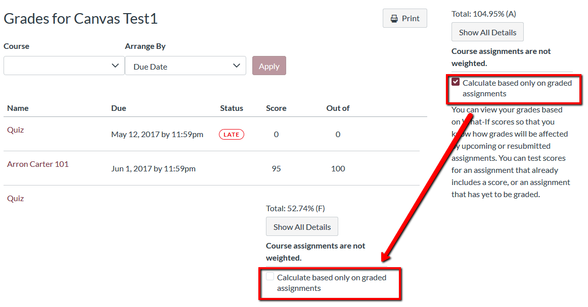

# Student Support \& Resources

Below you'll find materials of available supports for this course.

## Prof. Mason FAQ

https://smasongarrison.github.io/syllabi/frequently-asked-questions.html

## Canvas

### Canvas: Helpful Tips

#### Canvas Student Guide

The Canvas Student Guide provides information and guidance related to all things Canvas! Below, you will find both the text and video versions of the Student Guide: 

* [Canvas Student Guide - Table of Contents](https://community.canvaslms.com/t5/Student-Guide/tkb-p/student)
 
* [Canvas Student Video Guide - Table of Contents](https://community.canvaslms.com/t5/Student-Guide/tkb-p/student)

#### Getting Organized

Global Navigation:

* [How do I use the Global Navigation Menu? ](https://community.canvaslms.com/t5/Student-Guide/How-do-I-use-the-Global-Navigation-Menu-as-a-student/ta-p/522)

* [How do I use the Dashboard?](https://community.canvaslms.com/t5/Student-Guide/How-do-I-use-the-Dashboard-as-a-student/ta-p/512)

* [How do I use the To Do list and sidebar in the Dashboard?](https://community.canvaslms.com/t5/Student-Guide/How-do-I-use-the-To-Do-list-and-sidebar-in-the-Dashboard-as-a/ta-p/511)

Profile and User Settings:

* [How do I edit my profile in my user account? ](https://community.canvaslms.com/t5/Student-Guide/How-do-I-edit-my-profile-in-my-user-account-as-a-student/ta-p/421)

* [How do I add a profile picture in my user account?](https://community.canvaslms.com/t5/Student-Guide/How-do-I-add-a-profile-picture-in-my-user-account-as-a-student/ta-p/518)

* [How do I set my Canvas notification preferences?](https://community.canvaslms.com/t5/Student-Guide/How-do-I-manage-my-Canvas-notification-settings-as-a-student/ta-p/434)

* [Calendar](https://vimeo.com/78015141)

* [Files](https://vimeo.com/74772644)

### Canvas: Quick Links

#### Your Canvas Profile

* [Profiles](https://community.canvaslms.com/t5/Student-Guide/How-do-I-edit-my-profile-in-my-user-account-as-a-student/ta-p/421) allow you to update your name, preferred contact methods, and any personal links for your account. Your profile information can be viewed by all users in your courses. In an online course, your profile is an important way of letting your instructor and classmates "see" you.

#### Notifications

* The [notification](https://community.canvaslms.com/t5/Student-Guide/How-do-I-manage-my-Canvas-notification-settings-as-a-student/ta-p/434) system is designed to help you keep track of the activity in your Canvas sites. It's important that you customize the default settings to fit the way you want to receive notifications. (You don't want to miss any important communications from your instructor!)

#### Other Helpful Canvas Guides Links

* [Student Guide Table of Contents](https://community.canvaslms.com/t5/Student-Guide/tkb-p/student)
This will show you a list of all the topics within the Student Guides.

* [View your grades](https://community.canvaslms.com/t5/Student-Guide/How-do-I-view-my-grades-in-a-current-course/ta-p/493)
Learn how to view your grades, scoring details and instructor comments on assignments.

* [Submitting an online assignment](https://community.canvaslms.com/t5/Student-Guide/How-do-I-submit-an-online-assignment/ta-p/503)
Instructors can choose what kind of online submissions they want you to use. Learn how to submit your assignment online.

* [Using the Inbox](https://community.canvaslms.com/t5/Student-Guide/How-do-I-use-the-Inbox-as-a-student/ta-p/532)
Many instructors prefer (or even require) that you use the Canvas Inbox (also called "Conversations") rather than your regular email account.

* [Using Canvas on your mobile device](https://community.canvaslms.com/t5/Student-Guide/How-can-I-use-Canvas-on-my-mobile-device-as-a-student/ta-p/282)
On mobile devices, Canvas is designed to be used within Canvas mobile applications. Be aware that not all features are fully supported in the app. (It's recommended you do "sophisticated" tasks like taking quizzes and submitting assignments using a regular web browser.)

### Accurately Calculating Grades in Canvas

**Students: Make sure you are seeing the right grades in Canvas!**

* You're probably familiar with [checking your grades for a current course in Canvas](https://community.canvaslms.com/t5/Student-Guide/How-do-I-view-my-grades-in-a-current-course/ta-p/493), but did you know that you might not be seeing an accurate calculation of your final grade when you check your grades at the end of the semester?

* In order to get an accurate view of your final grade towards the end of the semester, make sure to uncheck the Calculate based only on graded assignments checkbox:

* You may also be seeing icons and colors when you view your grades. [Learn what these grade icons and colors mean](https://community.canvaslms.com/t5/Student-Guide/How-do-I-use-the-icons-and-colors-in-the-Grades-page/ta-p/476)

* Adapted from: [Florida State University Canvas Support](https://support.canvas.fsu.edu/kb/article/1068-students-make-sure-you-are-seeing-the-right-grades-in-canvas/)

## Resource Collections

### Student Support Services

The follow list is a non-exhaustive list of services that Wake Forest offers to students.

**[Learning Assistance Center](https://class.wfu.edu/)**

* [Academic Coaching](https://class.wfu.edu/): encourages students to strengthen a wide range of study skills including time management, note-taking, study skills, planning and organizing, test preparation, and test anxiety.

* [Disability Services](https://class.wfu.edu/): enable students with disabilities to experience equal access to the academic, social, and recreational activities and programs at Wake Forest University.

* [Peer Tutoring Program](https://class.wfu.edu/): provides individual or group assistance to any undergraduate student wishing to improve their learning in specific courses. Tutors focus on the learning process and help students make progress toward their academic goals.

**[Thrive Remotely ](https://thrive.wfu.edu/thrive-remotely-2/)**
* To support the students, faculty, and staff of Wake Forest University, the [Office of Wellbeing](https://thrive.wfu.edu/), Campus Recreation, and other colleagues at WFU have curated this hub of resources which encompass a variety of wellbeing topics to help our community as we transition to remote school and work.

#### [Crash Course: Study Skills](https://www.youtube.com/watch?v=E7CwqNHn_Ns&list=PL8dPuuaLjXtNcAJRf3bE1IJU6nMfHj86W)

#### [What are Office Hours?](https://vimeo.com/270014784?embedded=true&source=vimeo_logo&owner=2248721)

#### [What Are Course Evals and Why Should You Submit Them](https://www.youtube.com/watch?v=5zkAOpx8Qk8)

#### WFU Honor Code Definitions

**These definitions are reproduced from the [WFU Honor Code](https://studentconduct.wfu.edu/procedures-of-the-honor-and-ethics-council/)**

Cheating, plagiarism, stealing, deception, academic misconduct, and contempt are considered violations of the Honor Code. These terms should be construed to have their ordinary, non-legal meaning.

1. The term “cheating” includes:
  + (a) providing or receiving unauthorized assistance in academic endeavors (e.g., quizzes, tests, examinations, reports, term papers);

  + (b) use of sources beyond those authorized by the instructor in writing papers,     preparing reports, solving problems, or carrying out other assignments; or

  + (c) the use, without permission, of tests or other academic material belonging to a member of the University faculty or staff.

2. “Plagiarism” is a type of cheating. It includes:
  + (a) the use, by paraphrase or direct quotation, of the published or unpublished work of another person without complete acknowledgment of the source;

  + (b) the unacknowledged use of materials prepared by another agency or person providing term papers or other academic materials;

  + (c) the non-attributed use of any portion of a computer algorithm or data file; or

  + (d) the use, by paraphrase or direct quotation, of online material without complete acknowledgment of the source.

|      When faced with conflicting definitions of plagiarism during a case, the Honor and Ethics Council will adopt the definition established for use in the department/course by the department or professor involved in the case.

3. The term “stealing” includes:
  + (a) the unauthorized taking, misappropriation, or possession of any property belonging to, owned by, or maintained by the University, an organization, or another individual, or

  + (b) the possession, retention, or disposal of stolen property.

4. The term “deception” includes any false or deceiving representation. In the academic context, such representations include:
  + (a) any attempt to avoid meeting the stated course requirements, such as making false statements to avoid taking examinations at the scheduled times or to avoid turning in assignments at the scheduled times;

  + (b) listing sources in a bibliography not directly used in the academic exercise; or

  + (c) submitting falsified, invented, or fictitious data or evidence, or concealing or distorting the true nature, origin, or function of data or evidence.

|      In the social context, deceptive representations include:

  + (a) making a false statement to a University official, including Residence Advisors, or

  + (b) presenting a false identification.

5. The term “academic misconduct” may be used as a generic designation for all honor code violations in the academic context. As a specific charge it includes:
  + (a) the violation of University policies by tampering with grades

  + (b) taking part in obtaining or distributing any part of an unadministered academic exercise;

  + (c) any attempt to gain access or to aid another in gaining access to any computer account other than one’s own without proper authorization; or

  + (d) any attempt to gain access or to aid another in gaining access, without proper authorization, to department offices, faculty offices, laboratories, or any other place where unadministered assignments are kept.

6. The term “contempt” includes:
  + (a) instances of perjury (giving false testimony), or

  + (b) acts which otherwise obstruct the conduct process.

*Note: Cheating, stealing, making false or deceiving statements, plagiarism, vandalism, and harassment are just as wrong when done in the context of computing as they are in all other aspects of University conduct.*

### Discussion Board Etiquette
Here are a few websites that cover general guidelines for how to write discussion board posts.
* [Discussion Board Etiquette by Kay Lehmann and Lisa Chamberlin](https://www2.uwstout.edu/content/profdev/rubrics/discuss_etiquette.html)
* [Etiquette For Online Course Discussion Board Posts by Kelly Paul](http://learnmore.uncg.edu/blog/etiquette-for-online-course-discussion-boards)

Here's a useful and quick video on [discussion boards](https://www.youtube.com/watch?v=tg3y2A9pdtI)

#### [Poem 013: Did I Miss Anything? ](https://www.loc.gov/programs/poetry-and-literature/poet-laureate/poet-laureate-projects/poetry-180/all-poems/item/poetry-180-013/did-i-miss-anything/)

#### [Advice for students so they don't sound silly in emails (essay)](https://www.insidehighered.com/views/2015/04/16/advice-students-so-they-dont-sound-silly-emails-essay)

### Online Learning Resources
(leaving blank)

#### [Tips for Taking Online Classes: 8 Strategies for Success Links to an external site.](https://www.northeastern.edu/graduate/blog/tips-for-taking-online-classes/)

#### [Navigating Digital Information](https://www.youtube.com/watch?v=pLlv2o6UfTU&list=PL8dPuuaLjXtN07XYqqWSKpPrtNDiCHTzU)

### Tech Services \& Computer Resources

**Basic Computer Requirements**
Having regular access to a computer with a reliable Internet connection is required. You will need a word processing program capable of saving word formats such as .doc, .docx or .pdf. 

Check out the technical requirements for your computer and browser in order to maximize Canvas functionality: [Test your computer's readiness](https://apps.3cmediasolutions.org/oei/tools/computer-readiness.html)

**Plug-ins and Helper Applications**
There may be plug-ins and helper applications to download that support the Canvas environment and play multimedia such as:

* [Java](https://www.java.com/en/download/)
* [Adobe Reader](https://get.adobe.com/cn/reader/)
* [Adobe Flash Player](https://www.flash.cn/)
* [Windows Media Player](https://support.microsoft.com/en-us/windows/get-windows-media-player-81718e0d-cfce-25b1-aee3-94596b658287)
* [Quicktime](https://support.apple.com/kb/DL837?locale=zh_CN)
* [Apache Open Office for Microsoft Word](https://www.openoffice.org/download/index.html)
* [Microsoft Silverlight](https://www.microsoft.com/silverlight/)

**Browser Support**

While Chrome is the preferred browser for most Canvas interactions, Canvas supports the latest versions of every browser release. It's highly recommended that you update to the newest version of whatever browser you are using as well as the most up-to-date Flash plug-in. Check out the Canvas Browser Support page (Links to an external site.) for the most recent information.

**Contacting the Canvas Help Desk:**

You can search the Canvas Guides or contact the Canvas Support Helpline by clicking the Help icon (circle with a question mark) in the Account menu.

**Tech Support Cheat Sheet**

<!-- -->

## Public Health

**[WFU Covid Dashboard](https://ourwayforward.wfu.edu/covid-19-dashboard/)**
**[microCOVID Risk Calculator](https://www.microcovid.org/)**
**[NYT Covid Latest Map and Case Count Links to an external site.](https://www.nytimes.com/interactive/2021/us/north-carolina-covid-cases.html)**

